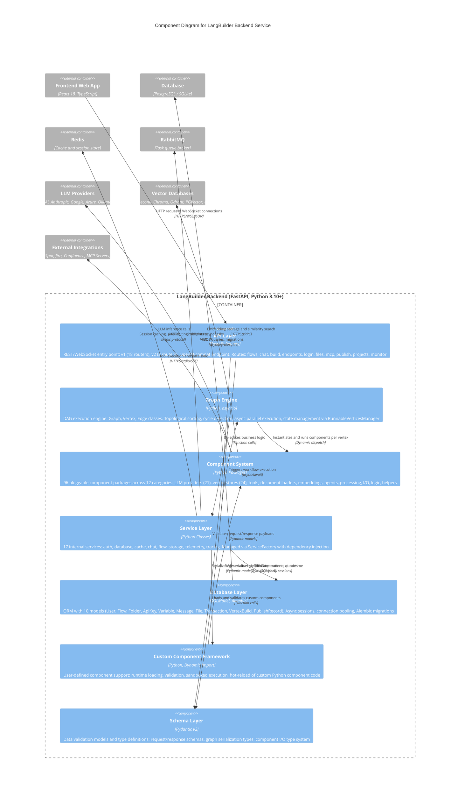

# C4 Component Diagram - LangBuilder Backend

> Generated: 2026-02-09 | LangBuilder v1.6.5

## Overview

This document presents the C4 Component (Level 3) diagram for the LangBuilder Backend service, decomposing the FastAPI application into its major internal components: the API layer, graph execution engine, pluggable component system, service layer, database layer, custom component framework, and schema layer.

## Component Diagram



## Components

### 1. API Layer

| Attribute | Value |
|-----------|-------|
| **Path** | `langbuilder/src/backend/base/langbuilder/api/` |
| **Technology** | FastAPI Routers |
| **Protocols** | REST (HTTP/JSON), WebSocket, SSE |

The API Layer is the entry point for all client interactions with the backend. It comprises 20 routers organized across two API versions plus an OpenAI-compatible endpoint.

**V1 Routers (18):**

| Router | Endpoint | File | Description |
|--------|----------|------|-------------|
| flows | `/api/v1/flows` | `v1/flows.py` | Workflow CRUD, upload, download, batch operations |
| chat | `/api/v1/build` | `v1/chat.py` | Flow build execution, SSE event streaming, cancel |
| users | `/api/v1/users` | `v1/users.py` | User account CRUD |
| api_key | `/api/v1/api_key` | `v1/api_key.py` | API key creation and management |
| login | `/api/v1/login` | `v1/login.py` | Authentication: login, logout, token refresh |
| files | `/api/v1/files` | `v1/files.py` | File upload and download |
| folders | `/api/v1/folders` | `v1/folders.py` | Project folder organization |
| projects | `/api/v1/projects` | `v1/projects.py` | Project-level management |
| variables | `/api/v1/variables` | `v1/variable.py` | Global variable and credential management |
| monitor | `/api/v1/monitor` | `v1/monitor.py` | Execution monitoring and observability |
| endpoints | `/api/v1/run` | `v1/endpoints.py` | Run deployed flows via API |
| validate | `/api/v1/validate` | `v1/validate.py` | Flow graph validation |
| store | `/api/v1/store` | `v1/store.py` | Component store browsing |
| publish | `/api/v1/publish` | `v1/publish.py` | Publish flows to Open WebUI |
| mcp | `/api/v1/mcp` | `v1/mcp.py` | MCP protocol handling (SSE/POST) |
| mcp_projects | `/api/v1/mcp/projects` | `v1/mcp_projects.py` | MCP server configuration |
| starter_projects | `/api/v1/starter-projects` | `v1/starter_projects.py` | Template flow management |
| voice_mode | `/api/v1/voice` | `v1/voice_mode.py` | Voice interface endpoints |

**V2 Routers (2):**

| Router | Endpoint | File | Description |
|--------|----------|------|-------------|
| files | `/api/v2/files` | `v2/files.py` | Enhanced file operations |
| mcp | `/api/v2/mcp` | `v2/mcp.py` | Extended MCP server management |

**OpenAI Compatibility** (`openai_compat_router.py`):

| Endpoint | Description |
|----------|-------------|
| `GET /v1/models` | List available flows as OpenAI-compatible models |
| `POST /v1/chat/completions` | Chat completions endpoint matching OpenAI API contract |

### 2. Graph Engine

| Attribute | Value |
|-----------|-------|
| **Path** | `langbuilder/src/backend/base/langbuilder/graph/` |
| **Technology** | Python, asyncio |
| **Pattern** | Directed Acyclic Graph (DAG) execution |

The Graph Engine is responsible for executing AI workflows as directed acyclic graphs. It converts the visual flow definition into an executable graph, resolves dependencies, and manages parallel execution.

**Core Classes:**

| Class | Module | Responsibility |
|-------|--------|----------------|
| `Graph` | `graph/base.py` | Top-level graph: builds DAG from flow JSON, triggers execution |
| `Vertex` | `vertex/base.py` | Represents a single node; wraps a component instance |
| `Edge` | `edge/base.py` | Represents a directed connection between two vertices |
| `RunnableVerticesManager` | `graph/runnable_vertices_manager.py` | Identifies independent vertices for parallel execution |
| `StateModel` | `state/model.py` | Manages mutable execution state across the graph run |

**Directory Structure:**

```
graph/
├── __init__.py          # Public API exports
├── schema.py            # Graph-level schemas
├── utils.py             # Graph utilities
├── edge/                # Edge handling
│   ├── base.py          # Edge class
│   ├── schema.py        # Edge schemas
│   └── utils.py         # Edge utilities
├── graph/               # Graph execution
│   ├── base.py          # Graph class - main execution
│   ├── runnable_vertices_manager.py  # Parallel execution
│   ├── state_model.py   # Graph state management
│   ├── constants.py     # Graph constants
│   └── utils.py         # Graph utilities
├── vertex/              # Node (vertex) handling
│   ├── base.py          # Vertex base class
│   ├── vertex_types.py  # Type definitions
│   ├── param_handler.py # Parameter processing
│   ├── constants.py     # Vertex constants
│   └── exceptions.py    # Vertex exceptions
└── state/               # Execution state
    └── model.py         # State model
```

**Key Capabilities:**
- Topological sorting to determine execution order
- Cycle detection to reject invalid graphs before execution
- Async parallel execution of independent vertices via `RunnableVerticesManager`
- State propagation between vertices along edges
- Error isolation per vertex with partial-graph success support

### 3. Component System

| Attribute | Value |
|-----------|-------|
| **Path** | `langbuilder/src/backend/base/langbuilder/components/` |
| **Technology** | Python packages, LangChain 0.3.x |
| **Scale** | 96 component packages across 12 categories |

The Component System provides the library of pre-built, pluggable building blocks that users wire together on the flow canvas.

**Categories:**

| Category | Count | Examples |
|----------|-------|----------|
| models (LLM providers) | 21 | OpenAI, Anthropic, Azure, Ollama, Groq, Mistral, DeepSeek, xAI, Nvidia, Amazon, VertexAI |
| vectorstores | 24 | Pinecone, Chroma, Qdrant, PGVector, FAISS, Milvus, Weaviate, AstraDB, Elasticsearch, MongoDB, Redis |
| tools | 15+ | Tavily Search, DuckDuckGo, Calculator, Python REPL, MCP tools |
| embeddings | 10+ | OpenAI, HuggingFace, Cohere, Google, Ollama |
| data (document loaders) | 8+ | File loader, URL, Unstructured, database readers |
| processing | 6+ | Text splitters, parsers, transformers |
| agents | 5+ | Tool-calling agents, ReAct, plan-and-execute |
| input_output | 4+ | Chat Input/Output, Webhook, Text Output |
| logic | 3+ | Conditional router, flow control, branching |
| helpers | 3+ | Memory, callbacks, prompt templates |
| custom_component | 1 | Base class for user-defined components |
| prototypes | varies | Experimental/beta features |

### 4. Service Layer

| Attribute | Value |
|-----------|-------|
| **Path** | `langbuilder/src/backend/base/langbuilder/services/` |
| **Technology** | Python classes, FastAPI dependency injection |
| **Scale** | 17 internal services |

The Service Layer contains the business logic and orchestration between the API layer and the lower-level engine, database, and external systems.

**Service Modules (17):**

| Service | Responsibility |
|---------|----------------|
| Auth Service | JWT authentication, OAuth, token refresh, API key validation |
| Database Service | Session management, transaction handling, connection pooling |
| Cache Service | Redis-backed caching, session storage, rate limiting |
| Chat Service | Chat message handling, conversation management |
| Flow Service | Flow CRUD orchestration, import/export |
| Storage Service | File storage abstraction (local, S3-compatible) |
| Telemetry Service | Usage metrics collection and reporting |
| Tracing Service | Execution tracing and observability |
| Session Service | User session management |
| Settings Service | Application settings and configuration |
| Socket Service | WebSocket connection management |
| State Service | Execution state management |
| Store Service | Component store operations |
| Task Service | Task execution (Celery and AnyIO backends) |
| Variable Service | Global variable and credential management |
| Job Queue Service | Background job queue handling |
| Shared Component Cache | Component caching across sessions |

**Service Architecture:**

| Module | File | Responsibility |
|--------|------|----------------|
| Service Factory | `factory.py` | Dependency injection container for service instantiation |
| Service Manager | `manager.py` | Service lifecycle management (startup, shutdown, lazy-loading) |
| Dependencies | `deps.py` | FastAPI dependency injection functions |
| OpenWebUI Client | `openwebui_client.py` | Integration with Open WebUI for flow publication |

### 5. Database Layer

| Attribute | Value |
|-----------|-------|
| **Path** | `langbuilder/src/backend/base/langbuilder/services/database/` |
| **Technology** | SQLModel (SQLAlchemy + Pydantic), Alembic |
| **Models** | 10 ORM models |

The Database Layer provides structured persistence through SQLModel ORM and manages schema evolution via Alembic migrations.

**Models:**

| Model | Table | Description |
|-------|-------|-------------|
| `User` | `user` | User accounts, profiles, roles |
| `Flow` | `flow` | Workflow definitions stored as JSON graph |
| `Folder` | `folder` | Project folder hierarchy |
| `ApiKey` | `apikey` | API key storage and rotation |
| `Variable` | `variable` | Encrypted credentials and global variables |
| `MessageTable` | `message` | Chat conversation messages |
| `File` | `file` | Uploaded file metadata and references |
| `TransactionTable` | `transaction` | Execution audit logs |
| `VertexBuildTable` | `vertex_build` | Per-node build results and outputs |
| `PublishRecord` | `publish_record` | External publication tracking |

**Capabilities:**
- Async database sessions via `asyncpg` (PostgreSQL) or `aiosqlite` (SQLite)
- Connection pooling for production workloads
- Alembic migration chain for schema versioning
- SQLite for development, PostgreSQL for production

### 6. Custom Component Framework

| Attribute | Value |
|-----------|-------|
| **Path** | `langbuilder/src/backend/base/langbuilder/custom/` |
| **Technology** | Python dynamic imports |
| **Pattern** | Runtime component registration |

The Custom Component Framework enables users to extend LangBuilder with their own Python components without modifying the core codebase.

**Capabilities:**
- Runtime loading of user-defined Python modules
- Validation of component interface compliance (inputs, outputs, build method)
- Registration into the Component System alongside built-in components
- Hot-reload support during development
- Sandboxed execution environment

### 7. Schema Layer

| Attribute | Value |
|-----------|-------|
| **Path** | `langbuilder/src/backend/base/langbuilder/schema/` |
| **Technology** | Pydantic v2 |
| **Pattern** | Data validation and serialization |

The Schema Layer defines the data contracts used throughout the backend, ensuring type safety and validation at API boundaries, graph serialization, and component I/O.

**Key Schema Groups:**
- **API schemas**: Request and response models for all REST endpoints
- **Graph schemas**: Serialization formats for Graph, Vertex, and Edge definitions
- **Component I/O types**: Type system for component input/output ports (strings, Data objects, Messages, etc.)
- **Configuration schemas**: Settings and environment configuration models

## Relationships

| Source | Target | Description | Technology |
|--------|--------|-------------|------------|
| Frontend Web App | API Layer | HTTP requests, WebSocket connections | HTTPS, WSS, JSON |
| API Layer | Service Layer | Delegates business logic | Python function calls |
| API Layer | Schema Layer | Validates request/response payloads | Pydantic models |
| Service Layer | Graph Engine | Triggers workflow execution for build/run | async/await |
| Service Layer | Database Layer | CRUD operations and queries | SQLModel async sessions |
| Service Layer | Redis (Cache) | Session caching, rate limiting, temp state | Redis protocol |
| Service Layer | RabbitMQ | Publishes long-running tasks to workers | AMQP |
| Service Layer | Custom Component Framework | Loads and validates user-defined components | Python imports |
| Graph Engine | Component System | Instantiates and runs component per vertex | Dynamic dispatch |
| Graph Engine | Schema Layer | Serializes/deserializes graph execution state | Pydantic models |
| Component System | LLM Providers | LLM inference API calls | HTTPS |
| Component System | Vector Databases | Embedding storage and similarity search | HTTPS, gRPC |
| Component System | External Integrations | Tool execution and data synchronization | HTTPS, stdio, SSE |
| Custom Component Framework | Component System | Registers user components at runtime | Python dynamic import |
| Database Layer | PostgreSQL/SQLite | SQL queries and schema migrations | asyncpg, aiosqlite |

## Request Flow

```
1. Client request arrives at API Layer (FastAPI router)
2. Schema Layer validates the request payload (Pydantic)
3. API Layer resolves auth via Service Layer (JWT/API key)
4. Router handler delegates to appropriate Service
5. Service orchestrates:
   a. Database Layer  -- persist/retrieve data
   b. Graph Engine    -- execute workflow (for /build, /run)
   c. Cache           -- check/store cached results
   d. Message Queue   -- offload async tasks
6. Graph Engine (when invoked):
   a. Builds DAG from flow JSON
   b. Topologically sorts vertices
   c. Iterates execution layers, running independent vertices in parallel
   d. Each Vertex instantiates its Component from Component System
   e. Components call external LLM/vector/tool APIs as needed
   f. State propagates along edges to downstream vertices
7. Response serialized via Schema Layer and returned to client
```

---

*Generated by CloudGeometry AIx SDLC - Architecture Documentation*
