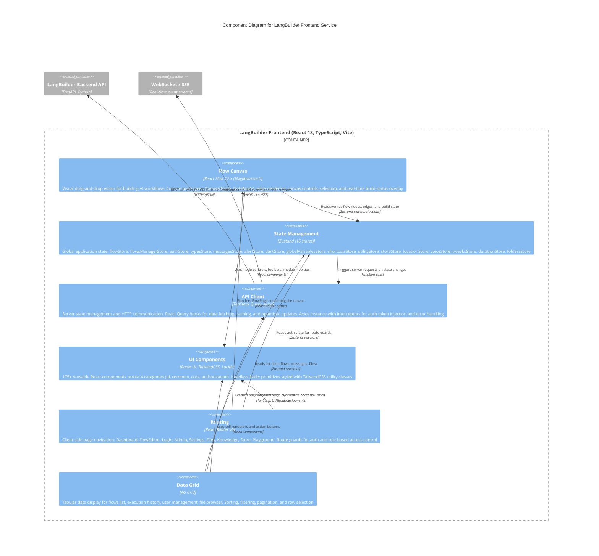

# C4 Component Diagram - LangBuilder Frontend

> Generated: 2026-02-09 | LangBuilder v1.6.5

## Overview

This document presents the C4 Component (Level 3) diagram for the LangBuilder Frontend service, decomposing the React single-page application into its major internal components: the Flow Canvas, state management stores, API client, UI component library, routing, and data grid.

## Component Diagram



## Components

### 1. Flow Canvas

| Attribute | Value |
|-----------|-------|
| **Path** | `langbuilder/src/frontend/src/pages/FlowPage/components/PageComponent/` |
| **Technology** | React Flow 12.x (`@xyflow/react`) |
| **Custom Nodes** | `langbuilder/src/frontend/src/CustomNodes/` |

The Flow Canvas is the core visual editor where users design AI workflows by dragging components from the sidebar and connecting them with edges. It is built on React Flow 12.x (XY Flow) with extensive customization.

**Key Sub-components:**

| Sub-component | Purpose |
|---------------|---------|
| PageComponent | Main canvas container, manages React Flow instance |
| GenericNode | Standard component node with typed input/output handles |
| NoteNode | Sticky note annotation node for documentation |
| ConnectionLineComponent | Custom edge drawing during drag-connect |
| SelectionMenuComponent | Context menu for multi-select operations |
| FlowBuildingComponent | Build progress overlay with per-node status |
| NodeInputField | Parameter input fields rendered inside nodes |
| NodeOutputField | Output handles with type indicators |
| HandleTooltip | Tooltip showing connection type on hover |
| OutputModal | Modal for inspecting vertex execution output |
| ComponentSidebar | Draggable component palette organized by category |

**Capabilities:**
- Drag-and-drop node placement from categorized sidebar
- Visual edge connections with type-compatibility validation
- Real-time build status indicators per node (idle, building, success, error)
- Zoom, pan, minimap, and canvas controls
- Multi-select, copy/paste, and undo/redo
- Node parameter editing inline and via inspector panel

### 2. State Management

| Attribute | Value |
|-----------|-------|
| **Path** | `langbuilder/src/frontend/src/stores/` |
| **Technology** | Zustand 4.x |
| **Scale** | 16 stores |

State Management uses Zustand to maintain global application state across the frontend. Each store is a focused, independently subscribable unit.

**Stores:**

| Store | File | State Managed |
|-------|------|---------------|
| flowStore | `flowStore.ts` | Current flow: nodes, edges, viewport, selection |
| flowsManagerStore | `flowsManagerStore.ts` | All flows list, active flow ID, CRUD operations |
| authStore | `authStore.ts` | Current user, tokens, login status, permissions |
| typesStore | `typesStore.ts` | Component type definitions loaded from backend |
| messagesStore | `messagesStore.ts` | Chat conversation messages for active session |
| alertStore | `alertStore.ts` | Toast notifications and alert queue |
| darkStore | `darkStore.ts` | Theme preference (light/dark mode) |
| globalVariablesStore | `globalVariables.ts` | Global variables and encrypted credential refs |
| shortcutsStore | `shortcuts.ts` | Keyboard shortcut bindings and state |
| utilityStore | `utilityStore.ts` | UI utility flags (sidebar open, modals, etc.) |
| storeStore | `storeStore.ts` | Component store browsing state |
| locationStore | `locationStore.ts` | Navigation breadcrumbs and history |
| voiceStore | `voiceStore.ts` | Voice mode recording and playback state |
| tweaksStore | `tweaksStore.ts` | API tweaks configuration for deployed flows |
| durationStore | `durationStore.ts` | Execution timing and performance metrics |
| foldersStore | `foldersStore.tsx` | Project folder hierarchy and active folder |

### 3. API Client

| Attribute | Value |
|-----------|-------|
| **Path** | `langbuilder/src/frontend/src/controllers/API/` |
| **Technology** | TanStack Query (React Query), Axios |
| **Pattern** | Server state management with client-side cache |

The API Client handles all communication between the frontend and the LangBuilder backend. It combines Axios for HTTP transport with TanStack Query for server state caching, background refetching, and optimistic updates.

**Structure (19 query categories, 100+ hooks):**

| Module | Path | Purpose |
|--------|------|---------|
| Base Axios instance | `api.tsx` | Configured with base URL, auth interceptor, error handler |
| Auth queries | `queries/auth/` | useLogin, useLogout, useRefreshToken (10 hooks) |
| Flow queries | `queries/flows/` | useFlowsQuery, useCreateFlow, useUpdateFlow, useDeleteFlow (10 hooks) |
| Folder queries | `queries/folders/` | Folder CRUD operations (9 hooks) |
| MCP queries | `queries/mcp/` | MCP server management (9 hooks) |
| File management | `queries/file-management/` | File operations (8 hooks) |
| Message queries | `queries/messages/` | useMessagesQuery, session operations (6 hooks) |
| Variable queries | `queries/variables/` | Global variable CRUD (5 hooks) |
| File queries | `queries/files/` | Upload, download, images (4 hooks) |
| Node queries | `queries/nodes/` | Validation, templates (4 hooks) |
| Build queries | `queries/_builds/` | Build status and polling (3 hooks) |
| API key queries | `queries/api-keys/` | API key management (3 hooks) |
| Knowledge bases | `queries/knowledge-bases/` | KB management (3 hooks) |
| Store queries | `queries/store/` | Tags, likes (2 hooks) |
| Additional | `queries/config/`, `health/`, `transactions/`, `version/`, `vertex/`, `voice/` | Config, health check, transactions, version, vertex order, voice |
| API helpers | `helpers/` | Request/response transformers, error mappers |

**Capabilities:**
- Automatic JWT token injection via Axios request interceptor
- Token refresh on 401 responses with request retry
- React Query cache with configurable stale times
- Optimistic updates for flow save operations
- SSE/WebSocket subscription for real-time build events
- Request deduplication and background refetching

### 4. UI Components

| Attribute | Value |
|-----------|-------|
| **Path** | `langbuilder/src/frontend/src/components/` |
| **Technology** | Radix UI, TailwindCSS 3.4, Lucide React |
| **Scale** | 175+ React components |

The UI Components layer provides the reusable design system for the entire application, built on headless Radix UI primitives styled with TailwindCSS utility classes.

**Component Categories:**

| Category | Path | Examples |
|----------|------|----------|
| ui (primitives) | `components/ui/` | Button, Input, Dialog, Dropdown, Tooltip, Select, Table, Toast, Badge, Card, Tabs |
| common (shared) | `components/common/` | Loading spinner, Icon wrapper, ErrorBoundary, EmptyState |
| core (app-level) | `components/core/` | Header, SidebarNav, ChatComponents, CanvasControls |
| authorization | `components/authorization/` | AuthGuard, AuthLoginGuard, AuthAdminGuard, AuthSettingsGuard, StoreGuard |

**Design System Foundations:**
- Radix UI provides accessible, headless component primitives (Dialog, Popover, DropdownMenu, etc.)
- TailwindCSS utility classes for consistent spacing, color, and typography
- Lucide React icon library for consistent iconography
- Dark mode support via CSS custom properties and theme toggle

### 5. Routing

| Attribute | Value |
|-----------|-------|
| **Path** | `langbuilder/src/frontend/src/routes.tsx` |
| **Technology** | React Router v6 (^6.23.1) |
| **Pattern** | Client-side routing with auth guards |
| **Pages Directory** | `langbuilder/src/frontend/src/pages/` (15 page directories) |

The Routing component manages client-side navigation and page rendering, wrapping routes with authentication and role-based access guards. App.tsx provides the root `<RouterProvider>`, while `routes.tsx` defines all route definitions.

**Route Map:**

| Route | Page | Guard |
|-------|------|-------|
| `/` | Dashboard (MainPage) | AuthGuard |
| `/flow/:id` | Flow Editor (FlowPage) | AuthGuard |
| `/login` | Login (LoginPage) | AuthLoginGuard (redirect if authenticated) |
| `/signup` | Sign Up (SignUpPage) | AuthLoginGuard |
| `/admin` | Admin Dashboard (AdminPage) | AuthAdminGuard |
| `/settings/*` | Settings Pages (general, global-variables, mcp-servers, api-keys, shortcuts, messages) | AuthSettingsGuard |
| `/files` | File Manager (FilesPage) | AuthGuard |
| `/knowledge` | Knowledge Base (KnowledgePage) | AuthGuard |
| `/store` | Component Store (StorePage) | StoreGuard |
| `/playground` | Playground | AuthGuard |
| `/delete-account` | Delete Account (DeleteAccountPage) | AuthGuard |

### 6. Data Grid

| Attribute | Value |
|-----------|-------|
| **Path** | Throughout list/table views |
| **Technology** | AG Grid |
| **Pattern** | Feature-rich tabular data display |

The Data Grid component provides tabular data presentation wherever list views are needed, using AG Grid for sorting, filtering, and pagination.

**Key Grid Instances:**

| Grid | Page | Columns |
|------|------|---------|
| Flows list | Dashboard | Name, modified date, status, folder, actions |
| Execution history | Monitor page | Flow name, timestamp, duration, status, inputs/outputs |
| User management | Admin page | Username, email, role, created date, actions |
| File browser | Files page | Name, type, size, upload date, actions |
| API keys list | Settings | Key name, created, last used, permissions, actions |

**Capabilities:**
- Column sorting (single and multi-column)
- Column filtering with type-appropriate filter controls
- Client-side and server-side pagination
- Row selection (single and multi-select)
- Custom cell renderers for status badges, action buttons, and links
- Responsive column sizing

## Relationships

| Source | Target | Description | Technology |
|--------|--------|-------------|------------|
| Routing | Flow Canvas | Renders FlowPage containing the canvas editor | React Router outlet |
| Routing | UI Components | Renders page layouts and shared UI shell | React components |
| Routing | State Management | Reads auth state for route guard evaluation | Zustand selectors |
| Flow Canvas | State Management | Reads/writes nodes, edges, build state | Zustand selectors and actions |
| Flow Canvas | UI Components | Uses node controls, toolbars, modals, tooltips | React component composition |
| State Management | API Client | Triggers server requests on state changes | Function calls |
| API Client | Backend API | REST calls for CRUD, build, chat, auth | HTTPS/JSON |
| API Client | WebSocket/SSE | Subscribes to build events and chat streams | WebSocket, SSE |
| Data Grid | State Management | Reads list data (flows, messages, files) | Zustand selectors |
| Data Grid | UI Components | Uses cell renderers and action buttons | React component composition |
| Data Grid | API Client | Fetches paginated data, submits inline edits | TanStack Query hooks |

## Data Flow

```
User Interaction (click, drag, type)
       |
       v
+------------------+     +-------------------+     +----------------+
| UI Components /  | --> | State Management  | --> | API Client     |
| Flow Canvas /    |     | (Zustand Stores)  |     | (TanStack +    |
| Data Grid        |     |                   |     |  Axios)        |
+------------------+     +-------------------+     +----------------+
       ^                                                  |
       |                                                  v
       |                                          +----------------+
       +------------------------------------------| Backend API    |
              Re-render on state update           | (FastAPI)      |
                                                  +----------------+
```

## Build Configuration

| Config | Value |
|--------|-------|
| **Build Tool** | Vite 5.4 |
| **Dev Port** | 5175 |
| **TypeScript** | 5.4.x |
| **React** | 18.3.x |
| **CSS Framework** | TailwindCSS 3.4 |
| **Package Manager** | npm |

## Key Dependencies

| Package | Version | Purpose |
|---------|---------|---------|
| `react` | ^18.3.1 | UI framework |
| `@xyflow/react` | ^12.3.6 | Flow canvas (React Flow) |
| `zustand` | ^4.5.2 | State management (16 stores) |
| `@tanstack/react-query` | ^5.49.2 | Server state and data fetching |
| `axios` | ^1.7.4 | HTTP client |
| `react-router-dom` | ^6.23.1 | Client-side routing |
| `ag-grid-react` | ^32.0.2 | Data grid |
| `@radix-ui/*` | various | Headless UI primitives |
| `tailwindcss` | ^3.4.4 | Utility-first CSS |
| `lucide-react` | ^0.x | Icon library |

---

*Generated by CloudGeometry AIx SDLC - Architecture Documentation*
