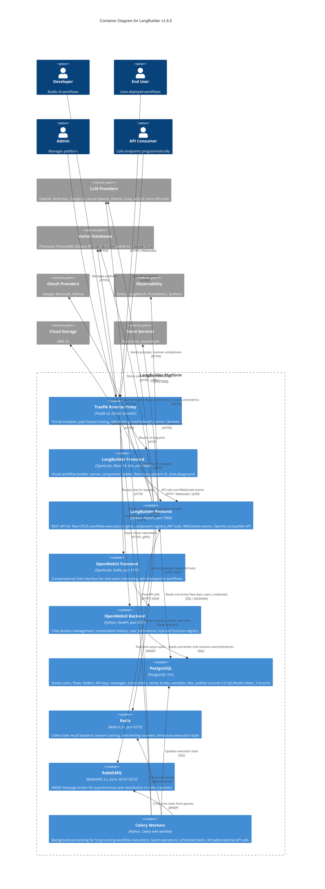

# C4 Container Diagram - LangBuilder

> Generated: 2026-02-09 | LangBuilder v1.6.5

## Overview

This document presents the Container (Level 2) diagram for LangBuilder, showing the high-level technology choices and how containers communicate. LangBuilder is deployed as a set of 4 application services plus supporting infrastructure services, all orchestrated via Docker and fronted by Traefik reverse proxy.

## Container Diagram


```mermaid
C4Container
    title Container Diagram for LangBuilder v1.6.5

    Person(developer, "Developer", "Builds AI workflows")
    Person(endUser, "End User", "Uses deployed workflows")
    Person(admin, "Admin", "Manages platform")
    Person(apiConsumer, "API Consumer", "Calls endpoints programmatically")

    System_Boundary(platform, "LangBuilder Platform") {

        Container(traefik, "Traefik Reverse Proxy", "Traefik v2, Docker provider", "TLS termination, path-based routing, rate limiting, load balancing across services")

        Container(lbFrontend, "LangBuilder Frontend", "TypeScript, React 18, Vite, port 3000", "Visual workflow builder canvas, component palette, flow management UI, chat playground")

        Container(lbBackend, "LangBuilder Backend", "Python, FastAPI, port 7860", "REST API for flow CRUD, workflow execution engine, component registry, JWT auth, WebSocket events, OpenAI-compatible API")

        Container(owuiFrontend, "OpenWebUI Frontend", "TypeScript, Svelte, port 5175", "Conversational chat interface for end users interacting with deployed AI workflows")

        Container(owuiBackend, "OpenWebUI Backend", "Python, FastAPI, port 8767", "Chat session management, conversation history, user preferences, tool and function registry")

        Container(postgres, "PostgreSQL", "PostgreSQL 15+", "Stores users, flows, folders, API keys, messages, transactions, vertex builds, variables, files, publish records (10 SQLModel tables, 3 enums)")

        Container(redis, "Redis", "Redis 6.2+, port 6379", "Celery task result backend, session caching, rate limiting counters, temporary execution state")

        Container(rabbitmq, "RabbitMQ", "RabbitMQ 3.x, ports 5672/15672", "AMQP message broker for asynchronous task distribution to Celery workers")

        Container(celeryWorker, "Celery Workers", "Python, Celery with eventlet", "Background processing for long-running workflow executions, batch operations, scheduled tasks, retryable external API calls")
    }

    System_Ext(llmProviders, "LLM Providers", "OpenAI, Anthropic, Google AI, Azure OpenAI, Ollama, Groq, and 22 more (28 total)")
    System_Ext(vectorDbs, "Vector Databases", "Pinecone, ChromaDB, Qdrant, PGVector, Milvus, and 8 more (13+ total)")
    System_Ext(oauthProviders, "OAuth Providers", "Google, Microsoft, GitHub")
    System_Ext(observability, "Observability", "Sentry, LangWatch, Prometheus, Grafana")
    System_Ext(cloudStorage, "Cloud Storage", "AWS S3")
    System_Ext(voiceServices, "Voice Services", "ElevenLabs, AssemblyAI")

    Rel(developer, traefik, "Builds workflows", "HTTPS")
    Rel(endUser, traefik, "Chats with flows", "HTTPS / WebSocket")
    Rel(admin, traefik, "Manages platform", "HTTPS")
    Rel(apiConsumer, traefik, "Calls API endpoints", "HTTPS")

    Rel(traefik, lbFrontend, "Routes UI requests", "HTTP")
    Rel(traefik, lbBackend, "Routes API requests", "HTTP")
    Rel(traefik, owuiFrontend, "Routes chat UI requests", "HTTP")
    Rel(traefik, owuiBackend, "Routes chat API requests", "HTTP")

    Rel(lbFrontend, lbBackend, "API calls and WebSocket events", "HTTP / WebSocket / JSON")
    Rel(owuiFrontend, owuiBackend, "Chat API calls", "HTTP / JSON")
    Rel(owuiBackend, lbBackend, "Invokes deployed flows and tools", "HTTP / REST")

    Rel(lbBackend, postgres, "Reads and writes flow data, users, credentials", "SQL / SQLModel")
    Rel(lbBackend, redis, "Caches sessions, stores rate limits", "Redis protocol")
    Rel(lbBackend, rabbitmq, "Publishes async tasks", "AMQP")

    Rel(owuiBackend, postgres, "Reads and writes chat sessions and preferences", "SQL")

    Rel(celeryWorker, rabbitmq, "Consumes tasks from queues", "AMQP")
    Rel(celeryWorker, redis, "Stores task results", "Redis protocol")
    Rel(celeryWorker, postgres, "Updates execution state", "SQL")

    Rel(lbBackend, llmProviders, "Sends prompts, receives completions", "HTTPS")
    Rel(lbBackend, vectorDbs, "Stores and retrieves embeddings", "HTTPS / gRPC")
    Rel(lbBackend, oauthProviders, "OAuth 2.0 authentication flows", "HTTPS")
    Rel(lbBackend, observability, "Sends errors, traces, and metrics", "HTTPS")
    Rel(lbBackend, cloudStorage, "Uploads and retrieves files", "HTTPS")
    Rel(lbBackend, voiceServices, "TTS and STT operations", "HTTPS")

    Rel(celeryWorker, llmProviders, "Async LLM calls from background tasks", "HTTPS")
    Rel(celeryWorker, vectorDbs, "Async vector operations", "HTTPS / gRPC")

    UpdateLayoutConfig($c4ShapeInRow="3", $c4BoundaryInRow="1")
```

## Container Details

### Traefik Reverse Proxy

| Attribute | Value |
|-----------|-------|
| **Technology** | Traefik v2 with Docker provider |
| **Ports** | 80 (HTTP), 443 (HTTPS) |
| **Role** | Entry point for all external traffic |

**Key Responsibilities:**
- TLS termination for all inbound HTTPS connections
- Path-based and host-based routing to the four application services
- Load balancing across multiple backend replicas in production
- Rate limiting and request throttling
- Automatic service discovery via Docker labels
- Health check probing for upstream services

### LangBuilder Frontend

| Attribute | Value |
|-----------|-------|
| **Technology** | React 18.3, TypeScript 5.4, Vite 5.4 |
| **Port** | 3000 |
| **Source Path** | `langbuilder/src/frontend/` |
| **State Management** | Zustand |
| **UI Framework** | Radix UI + TailwindCSS |
| **Flow Canvas** | @xyflow/react (XY Flow) |

**Key Responsibilities:**
- Visual drag-and-drop workflow canvas for designing AI flows
- Component palette with 96 component packages organized by category
- Real-time flow execution and testing via the playground
- Chat interface for interacting with deployed workflows
- User authentication UI (login, OAuth redirects, session management)
- Flow import/export and sharing capabilities
- File upload and management interface

### LangBuilder Backend

| Attribute | Value |
|-----------|-------|
| **Technology** | FastAPI, Python 3.10-3.14 |
| **Port** | 7860 (Docker), 8002 (local development) |
| **Source Path** | `langbuilder/src/backend/base/langbuilder/` |
| **ORM** | SQLModel (SQLAlchemy + Pydantic) |
| **AI Framework** | LangChain 0.3.x |

**Key Responsibilities:**
- REST API for flow CRUD operations
- Workflow graph execution engine (DAG resolution, topological node execution)
- Component registry and discovery (96 packages)
- User authentication: JWT tokens, OAuth 2.0 (Google, Microsoft, GitHub), API keys
- WebSocket connections for real-time build events and streaming responses
- OpenAI-compatible API endpoint (`/v1/chat/completions`)
- Integration dispatch to 28 LLM providers, 13+ vector databases, and 62 total integrations
- File upload handling and S3 delegation
- Credential encryption and variable management

**API Versions:**
- `/api/v1/*` -- Primary API (18 routers)
- `/api/v2/*` -- Extended API (2 routers)
- `/v1/chat/completions` -- OpenAI compatibility layer

### OpenWebUI Frontend

| Attribute | Value |
|-----------|-------|
| **Technology** | Svelte, TypeScript, Vite |
| **Port** | 5175 |
| **Role** | End-user-facing conversational chat interface |

**Key Responsibilities:**
- Conversational chat UI for end users interacting with deployed AI workflows
- Markdown rendering, code highlighting, and rich media display
- Model and pipeline selection from available deployed flows
- User preference management (theme, default models, display settings)
- Chat history browsing and search

### OpenWebUI Backend

| Attribute | Value |
|-----------|-------|
| **Technology** | FastAPI, Python |
| **Port** | 8767 |
| **Role** | Chat session management and tool/function registry |

**Key Responsibilities:**
- Chat session persistence and conversation history
- User preference storage
- Tool and function registry for exposing LangBuilder flows as callable tools
- Proxy layer that invokes LangBuilder Backend to execute deployed workflows
- Model routing and pipeline management

### PostgreSQL Database

| Attribute | Value |
|-----------|-------|
| **Technology** | PostgreSQL 15+ (production), SQLite (development) |
| **Port** | 5432 |
| **Migrations** | Alembic |
| **ORM** | SQLModel |

**Schema (10 tables, 3 enums):**

| Table | Purpose |
|-------|---------|
| `user` | User accounts, profiles, roles, and hashed passwords |
| `flow` | Workflow definitions stored as JSON graph structures |
| `folder` | Hierarchical project organization for flows |
| `apikey` | API key records with hashed key values and permissions |
| `message` | Chat message history linked to flows and sessions |
| `transaction` | Execution logs capturing inputs, outputs, and timing |
| `vertex_build` | Individual node build results within a flow execution |
| `variable` | Encrypted credentials and environment variables |
| `file` | Uploaded file metadata with S3 references |
| `publish_record` | Tracking of flows published to external systems (OpenWebUI) |

**Enums:** User role, flow status, transaction status.

### Redis Cache

| Attribute | Value |
|-----------|-------|
| **Technology** | Redis 6.2+ |
| **Port** | 6379 |

**Key Responsibilities:**
- Celery task result backend (stores return values from completed tasks)
- Session caching for faster JWT validation and user lookups
- Rate limiting counters (per-user, per-API-key request limits)
- Temporary execution state during multi-step workflow runs

### RabbitMQ Message Broker

| Attribute | Value |
|-----------|-------|
| **Technology** | RabbitMQ 3.x |
| **Ports** | 5672 (AMQP), 15672 (Management UI) |

**Key Responsibilities:**
- AMQP message broker for distributing tasks to Celery workers
- Message persistence and acknowledgment for reliable task delivery
- Work queue management with configurable prefetch and priority
- Dead-letter queue for failed task inspection

### Celery Workers

| Attribute | Value |
|-----------|-------|
| **Technology** | Celery with eventlet pool |
| **Concurrency** | 1 per worker (configurable) |
| **Broker** | RabbitMQ |
| **Result Backend** | Redis |

**Key Responsibilities:**
- Long-running workflow executions that exceed synchronous request timeouts
- Batch operations (bulk flow import/export, mass re-indexing)
- Scheduled and periodic tasks
- External API calls with automatic retry logic and exponential backoff
- Asynchronous LLM calls and vector store operations

## Communication Patterns

### Synchronous Request/Response

All user-facing interactions follow synchronous HTTP request/response patterns through Traefik.

```
User --> Traefik ---> LangBuilder Frontend ---> LangBuilder Backend ---> PostgreSQL
                  |                                    |
                  +--> OpenWebUI Frontend ---> OpenWebUI Backend ---+
                                                    |
                                                    +--> LangBuilder Backend (flow invocation)
```

Backend-to-external-system calls during synchronous flow execution:

```
LangBuilder Backend --HTTPS--> LLM Providers (prompt/completion)
                    --HTTPS/gRPC--> Vector Databases (embed/retrieve)
                    --HTTPS--> OAuth Providers (token exchange)
                    --HTTPS--> Cloud Storage (file upload/download)
                    --HTTPS--> Voice Services (TTS/STT)
```

### Asynchronous Task Processing

Long-running operations are offloaded to Celery workers via RabbitMQ.

```
LangBuilder Backend --AMQP--> RabbitMQ --AMQP--> Celery Worker
                                                       |
                                                       +--SQL--> PostgreSQL
                                                       +--Redis--> Redis (result)
                                                       +--HTTPS--> LLM Providers
                                                       +--HTTPS/gRPC--> Vector DBs
```

### Real-time Streaming

WebSocket and Server-Sent Events (SSE) provide real-time updates during flow execution.

```
LangBuilder Frontend <--WebSocket--> LangBuilder Backend (build events, token streaming)
OpenWebUI Frontend   <--SSE-------> OpenWebUI Backend    (chat response streaming)
```

### Observability Data Flow

Metrics and traces flow from application services to the observability stack.

```
LangBuilder Backend --SDK--> Sentry (errors, performance)
                    --SDK--> LangWatch (LLM traces, token usage, cost)
                    --/metrics endpoint--> Prometheus --query--> Grafana (dashboards)
```

## Deployment Configurations

### Development

| Aspect | Configuration |
|--------|--------------|
| Database | SQLite (file-based, zero configuration) |
| Backend | Single process on port 8002 |
| Frontend | Vite dev server on port 3000 with HMR |
| Message Queue | Not required (tasks run in-process) |
| Cache | Optional (in-memory fallback) |
| Reverse Proxy | Not required (direct port access) |

### Production (Docker Compose)

| Aspect | Configuration |
|--------|--------------|
| Database | PostgreSQL 15+ with connection pooling |
| Backend | Multiple replicas behind Traefik on port 7860 |
| Frontend | Built static assets served via Traefik |
| OpenWebUI Frontend | Svelte build served via Traefik on port 5175 |
| OpenWebUI Backend | FastAPI on port 8767 |
| Message Queue | RabbitMQ for reliable task distribution |
| Cache | Redis for result backend and session caching |
| Workers | Celery workers with eventlet concurrency |
| Reverse Proxy | Traefik with TLS, routing, and load balancing |
| Monitoring | Prometheus + Grafana stack |

## Port Mapping Summary

| Service | Container Port | Protocol | Description |
|---------|---------------|----------|-------------|
| Traefik | 80 / 443 | HTTP / HTTPS | External entry point |
| LangBuilder Frontend | 3000 | HTTP | React workflow builder UI |
| LangBuilder Backend | 7860 | HTTP / WS | FastAPI application server |
| OpenWebUI Frontend | 5175 | HTTP | Svelte chat interface |
| OpenWebUI Backend | 8767 | HTTP | FastAPI chat management |
| PostgreSQL | 5432 | TCP | Database connections |
| Redis | 6379 | TCP | Cache and result backend |
| RabbitMQ | 5672 | AMQP | Task queue messaging |
| RabbitMQ Management | 15672 | HTTP | Queue monitoring UI |
| Prometheus | 9090 | HTTP | Metrics collection |
| Grafana | 3000 | HTTP | Monitoring dashboards |

---

*Generated by CloudGeometry AIx SDLC - Architecture Documentation*
