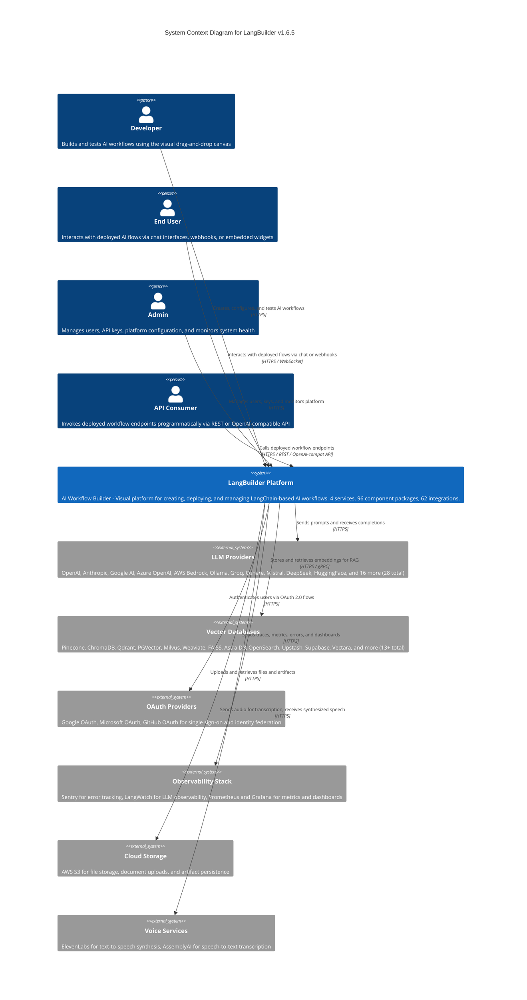

# C4 Context Diagram - LangBuilder

> Generated: 2026-02-09 | LangBuilder v1.6.5

## Overview

This document presents the System Context (Level 1) diagram for LangBuilder, showing the system's boundaries and its interactions with external actors and external systems. LangBuilder is an AI workflow builder platform (fork/extension of LangFlow) organized as a UV workspace monorepo with two packages: `langbuilder` (main application) and `langbuilder-base` (library). The platform supports 28 LLM providers, 13+ vector databases, 96 component packages, and 62 total integrations across AI, observability, infrastructure, and auth categories.

## System Context Diagram


```mermaid
C4Context
    title System Context Diagram for LangBuilder v1.6.5

    Person(developer, "Developer", "Builds and tests AI workflows using the visual drag-and-drop canvas")
    Person(endUser, "End User", "Interacts with deployed AI flows via chat interfaces, webhooks, or embedded widgets")
    Person(admin, "Admin", "Manages users, API keys, platform configuration, and monitors system health")
    Person(apiConsumer, "API Consumer", "Invokes deployed workflow endpoints programmatically via REST or OpenAI-compatible API")

    System(langbuilder, "LangBuilder Platform", "AI Workflow Builder - Visual platform for creating, deploying, and managing LangChain-based AI workflows. 4 services, 96 component packages, 62 integrations.")

    System_Ext(llmProviders, "LLM Providers", "OpenAI, Anthropic, Google AI, Azure OpenAI, AWS Bedrock, Ollama, Groq, Cohere, Mistral, DeepSeek, HuggingFace, and 16 more (28 total)")
    System_Ext(vectorDbs, "Vector Databases", "Pinecone, ChromaDB, Qdrant, PGVector, Milvus, Weaviate, FAISS, Astra DB, OpenSearch, Upstash, Supabase, Vectara, and more (13+ total)")
    System_Ext(oauthProviders, "OAuth Providers", "Google OAuth, Microsoft OAuth, GitHub OAuth for single sign-on and identity federation")
    System_Ext(observability, "Observability Stack", "Sentry for error tracking, LangWatch for LLM observability, Prometheus and Grafana for metrics and dashboards")
    System_Ext(cloudStorage, "Cloud Storage", "AWS S3 for file storage, document uploads, and artifact persistence")
    System_Ext(voiceServices, "Voice Services", "ElevenLabs for text-to-speech synthesis, AssemblyAI for speech-to-text transcription")

    Rel(developer, langbuilder, "Creates, configures, and tests AI workflows", "HTTPS")
    Rel(endUser, langbuilder, "Interacts with deployed flows via chat or webhooks", "HTTPS / WebSocket")
    Rel(admin, langbuilder, "Manages users, keys, and monitors platform", "HTTPS")
    Rel(apiConsumer, langbuilder, "Calls deployed workflow endpoints", "HTTPS / REST / OpenAI-compat API")

    Rel(langbuilder, llmProviders, "Sends prompts and receives completions", "HTTPS")
    Rel(langbuilder, vectorDbs, "Stores and retrieves embeddings for RAG", "HTTPS / gRPC")
    Rel(langbuilder, oauthProviders, "Authenticates users via OAuth 2.0 flows", "HTTPS")
    Rel(langbuilder, observability, "Sends traces, metrics, errors, and dashboards", "HTTPS")
    Rel(langbuilder, cloudStorage, "Uploads and retrieves files and artifacts", "HTTPS")
    Rel(langbuilder, voiceServices, "Sends audio for transcription, receives synthesized speech", "HTTPS")

    UpdateLayoutConfig($c4ShapeInRow="4", $c4BoundaryInRow="1")
```

## External Actors

### Actor Summary

| Actor | Role | Primary Interactions | Protocol |
|-------|------|---------------------|----------|
| **Developer** | Builds AI workflows using the visual canvas interface. Configures components, connects nodes, tests flows in real time, and deploys workflows as API endpoints. | Create flows, configure LLM and tool components, test and iterate on the canvas, deploy to production | HTTPS |
| **End User** | Consumes deployed AI workflows through chat interfaces, embedded widgets, or webhook-triggered automations. Has no access to the workflow builder itself. | Chat with deployed flows, trigger webhooks, receive AI-generated responses | HTTPS, WebSocket |
| **Admin** | Manages the platform at the organizational level. Handles user provisioning, API key rotation, OAuth configuration, resource quotas, and monitors system health via observability dashboards. | User management, API key administration, OAuth provider setup, Grafana/Prometheus monitoring | HTTPS |
| **API Consumer** | Integrates with LangBuilder programmatically. Uses deployed flow endpoints from external applications, CI/CD pipelines, or other backend services. Authenticates via API keys. | Call `/api/v1/run/{flow_id}`, use `/v1/chat/completions` (OpenAI-compatible), manage flows via REST API | HTTPS, REST |

### Authentication Methods by Actor

| Actor | Auth Methods |
|-------|-------------|
| Developer | JWT (username/password), OAuth (Google, Microsoft, GitHub) |
| End User | JWT session, API key (for programmatic access) |
| Admin | JWT with admin role, OAuth with elevated privileges |
| API Consumer | API key (`x-api-key` header) |

## External Systems

### LLM Providers (28 supported)

LangBuilder integrates with 28 LLM providers through LangChain abstractions, enabling seamless provider switching without workflow changes.

| Provider | Models / Capabilities | Use Case |
|----------|----------------------|----------|
| OpenAI | GPT-4o, GPT-4, GPT-3.5-turbo, DALL-E, Whisper | General purpose, function calling, vision, image generation |
| Anthropic | Claude 3.5 Sonnet, Claude 3 Opus/Haiku | Complex reasoning, long context, coding tasks |
| Google AI | Gemini Pro, Gemini Flash, PaLM 2 | Multimodal, fast inference, VertexAI integration |
| Azure OpenAI | Azure-hosted OpenAI models | Enterprise compliance, data residency requirements |
| AWS Bedrock | Claude, Titan, Llama via Bedrock | AWS-native AI workloads, enterprise deployment |
| Ollama | Llama 3, Mistral, Phi, CodeLlama | Local/private deployment, air-gapped environments |
| Groq | Llama, Mixtral on LPU hardware | Ultra-low latency inference |
| Cohere | Command R+, Embed, Rerank | RAG optimization, multilingual embeddings |
| Mistral | Mistral Large, Medium, Small | European AI compliance, efficient models |
| DeepSeek | DeepSeek-V2, Coder | Code generation, mathematical reasoning |
| HuggingFace | Open-source model hub | Custom and fine-tuned models |
| Others | 17 additional providers | Specialized and regional use cases |

### Vector Databases (13+ supported)

| Category | Databases | Purpose |
|----------|-----------|---------|
| Cloud-hosted | Pinecone, Qdrant Cloud, Weaviate Cloud, Astra DB, Upstash, Vectara, Supabase | Production RAG at scale, managed infrastructure |
| Self-hosted | ChromaDB, Milvus, FAISS | Development, on-premise, air-gapped environments |
| Database extensions | PGVector, OpenSearch, Elasticsearch | Leverage existing database infrastructure for vector search |

### OAuth Providers

| Provider | Protocol | Capabilities |
|----------|----------|-------------|
| Google | OAuth 2.0 / OpenID Connect | SSO, user identity, profile information |
| Microsoft | OAuth 2.0 / OpenID Connect | Enterprise SSO, Azure AD integration |
| GitHub | OAuth 2.0 | Developer identity, organization membership |

### Observability Stack

| System | Role | Integration Type |
|--------|------|-----------------|
| Sentry | Error tracking and performance monitoring | SDK integration, automatic exception capture |
| LangWatch | LLM-specific observability (token usage, latency, cost tracking) | Trace instrumentation on LLM calls |
| Prometheus | Metrics collection (request rates, latencies, queue depths) | `/metrics` endpoint scraping |
| Grafana | Dashboards and alerting | Reads from Prometheus data source |

### Cloud Storage

| Service | Purpose | Integration |
|---------|---------|-------------|
| AWS S3 | File uploads, document storage, flow export artifacts | boto3 SDK, presigned URLs |

### Voice Services

| Service | Capability | Integration |
|---------|-----------|-------------|
| ElevenLabs | Text-to-speech synthesis with realistic voice cloning | REST API, streaming audio |
| AssemblyAI | Speech-to-text transcription, speaker diarization | REST API, async transcription |

## Key Integration Patterns

1. **LLM Abstraction Layer**: All LLM calls route through LangChain model abstractions, enabling provider switching by changing a single component configuration without rewiring the workflow graph.
2. **Vector Store Interface**: Unified retrieval interface across all 13+ vector databases. Workflows using RAG patterns remain portable across vector store backends.
3. **Tool Invocation Protocol**: LangChain tools pattern for external API calls. Each integration exposes a standard tool interface that LLM agents can discover and invoke.
4. **MCP Protocol**: Model Context Protocol for dynamic tool discovery and execution via stdio/SSE transports.
5. **OAuth Federation**: JWT-based session management with OAuth 2.0 delegation to Google, Microsoft, and GitHub for identity verification.
6. **Webhook Ingress**: Inbound webhooks allow external systems to trigger workflow execution asynchronously.

## Security Boundaries

```
                        Internet
                           |
                    +------+------+
                    |   Traefik   |  (TLS termination, routing, rate limiting)
                    +------+------+
                           |
          +----------------+----------------+
          |       LangBuilder Platform      |
          |                                 |
          |  +----------+  +-------------+  |
          |  | Frontend |  | OpenWebUI   |  |
          |  | (React)  |  | Frontend    |  |
          |  +----+-----+  +------+------+  |
          |       |               |         |
          |  +----+-----+  +-----+-------+ |
          |  | Backend  |  | OpenWebUI   | |
          |  | (FastAPI) |  | Backend    | |
          |  +----+-----+  +------+------+ |
          |       |               |         |
          |  +----+-----+  +-----+------+  |
          |  | Database |  | Redis /    |  |
          |  | (PG/SQL) |  | RabbitMQ   |  |
          |  +----------+  +------------+  |
          +---------------------------------+
                           |
                External API Calls (HTTPS)
                           |
          +---------------------------------+
          |     External Systems Boundary   |
          |  LLM Providers, Vector DBs,     |
          |  OAuth, S3, Voice, Observability |
          +---------------------------------+
```

## Data Flow Summary

1. **Inbound**: User requests arrive via HTTPS at Traefik, which routes to the appropriate frontend or backend service based on path and host rules.
2. **Authentication**: JWT tokens are validated on every API request. OAuth flows delegate to external identity providers and return JWT sessions.
3. **Workflow Execution**: The backend parses the workflow DAG, resolves component dependencies, and executes nodes in topological order, making external API calls as needed.
4. **Outbound**: LLM prompts, vector operations, and integration calls are dispatched to external systems over HTTPS or gRPC.
5. **Persistence**: Flow definitions (JSON graphs), user data, messages, and execution logs are stored in the database. Files are stored in S3.
6. **Observability**: Errors are sent to Sentry, LLM traces to LangWatch, and metrics are exposed to Prometheus for Grafana dashboards.

---

*Generated by CloudGeometry AIx SDLC - Architecture Documentation*
