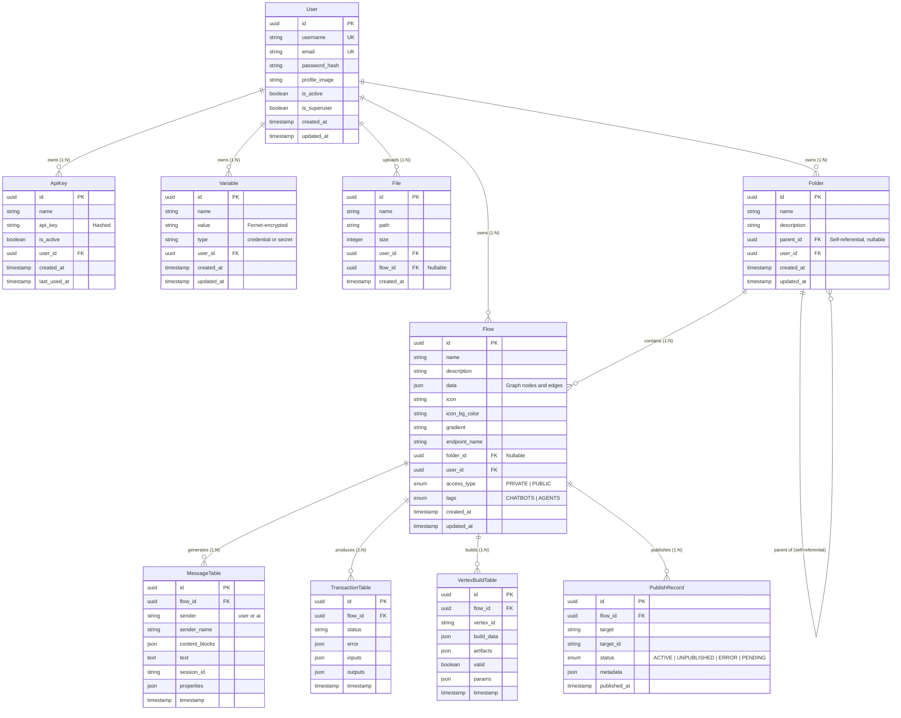
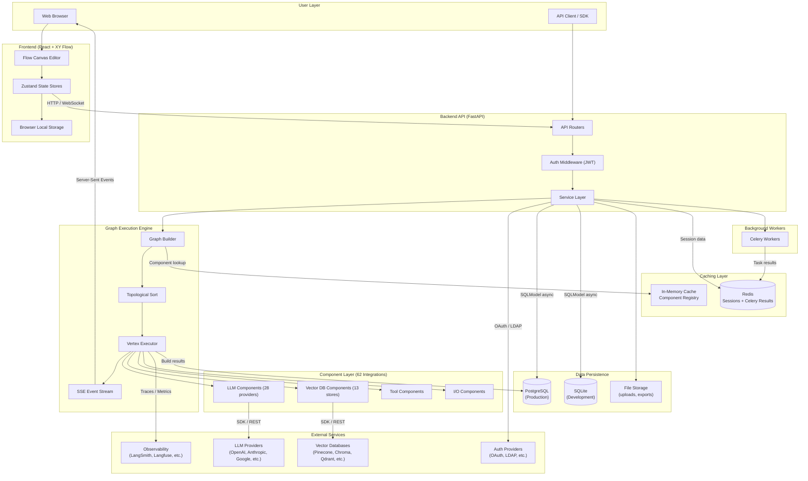

# Data Architecture - LangBuilder

> Generated: 2026-02-09 | LangBuilder v1.6.5

## Overview

This document describes the data architecture for LangBuilder, including the database schema, entity relationships, data flow patterns, caching strategies, data consistency mechanisms, and the variable encryption approach. LangBuilder uses SQLModel (SQLAlchemy + Pydantic) as its ORM, with SQLite for development and PostgreSQL for production, Alembic for schema migrations, and Redis for caching and task result storage.

---

## Entity Relationship Diagram

The following ER diagram captures all 10 data models, 3 enums, and the relationships between them.


```mermaid
erDiagram
    User ||--o{ Flow : "owns (1:N)"
    User ||--o{ ApiKey : "owns (1:N)"
    User ||--o{ Variable : "owns (1:N)"
    User ||--o{ File : "uploads (1:N)"
    User ||--o{ Folder : "owns (1:N)"

    Folder ||--o{ Flow : "contains (1:N)"
    Folder ||--o{ Folder : "parent of (self-referential)"

    Flow ||--o{ MessageTable : "generates (1:N)"
    Flow ||--o{ TransactionTable : "produces (1:N)"
    Flow ||--o{ VertexBuildTable : "builds (1:N)"
    Flow ||--o{ PublishRecord : "publishes (1:N)"

    User {
        uuid id PK
        string username UK
        string email UK
        string password_hash
        string profile_image
        boolean is_active
        boolean is_superuser
        timestamp created_at
        timestamp updated_at
    }

    Flow {
        uuid id PK
        string name
        string description
        json data "Graph nodes and edges"
        string icon
        string icon_bg_color
        string gradient
        string endpoint_name
        uuid folder_id FK "Nullable"
        uuid user_id FK
        enum access_type "PRIVATE | PUBLIC"
        enum tags "CHATBOTS | AGENTS"
        timestamp created_at
        timestamp updated_at
    }

    Folder {
        uuid id PK
        string name
        string description
        uuid parent_id FK "Self-referential, nullable"
        uuid user_id FK
        timestamp created_at
        timestamp updated_at
    }

    ApiKey {
        uuid id PK
        string name
        string api_key "Hashed"
        boolean is_active
        uuid user_id FK
        timestamp created_at
        timestamp last_used_at
    }

    Variable {
        uuid id PK
        string name
        string value "Fernet-encrypted"
        string type "credential or secret"
        uuid user_id FK
        timestamp created_at
        timestamp updated_at
    }

    MessageTable {
        uuid id PK
        uuid flow_id FK
        string sender "user or ai"
        string sender_name
        json content_blocks
        text text
        string session_id
        json properties
        timestamp timestamp
    }

    TransactionTable {
        uuid id PK
        uuid flow_id FK
        string status
        json error
        json inputs
        json outputs
        timestamp timestamp
    }

    VertexBuildTable {
        uuid id PK
        uuid flow_id FK
        string vertex_id
        json build_data
        json artifacts
        boolean valid
        json params
        timestamp timestamp
    }

    File {
        uuid id PK
        string name
        string path
        integer size
        uuid user_id FK
        uuid flow_id FK "Nullable"
        timestamp created_at
    }

    PublishRecord {
        uuid id PK
        uuid flow_id FK
        string target
        string target_id
        enum status "ACTIVE | UNPUBLISHED | ERROR | PENDING"
        json metadata
        timestamp published_at
    }
```

### Enumeration Types

| Enum | Values | Used By |
|------|--------|---------|
| **AccessTypeEnum** | `PRIVATE`, `PUBLIC` | Flow (visibility control) |
| **PublishStatusEnum** | `ACTIVE`, `UNPUBLISHED`, `ERROR`, `PENDING` | PublishRecord (lifecycle state) |
| **Tags** | `CHATBOTS`, `AGENTS` | Flow (categorization) |

### Key Relationship Summary

| Relationship | Type | Description |
|-------------|------|-------------|
| User to Flow | One-to-Many | A user owns zero or more flows |
| User to ApiKey | One-to-Many | A user owns zero or more API keys |
| User to Variable | One-to-Many | A user owns zero or more encrypted variables |
| User to Folder | One-to-Many | A user owns zero or more folders |
| User to File | One-to-Many | A user uploads zero or more files |
| Flow to Folder | Many-to-One | A flow optionally belongs to one folder |
| Folder to Folder | Self-referential | A folder optionally has a parent folder (nested hierarchy) |
| Flow to MessageTable | One-to-Many | A flow generates zero or more chat messages |
| Flow to TransactionTable | One-to-Many | A flow produces zero or more execution transactions |
| Flow to VertexBuildTable | One-to-Many | A flow produces zero or more vertex build records |
| PublishRecord to Flow | Many-to-One | Multiple publish records can reference a single flow |

---

## Data Flow Diagram

The following diagram traces data movement from user interaction through the full execution pipeline, including persistence and caching layers.


```mermaid
flowchart TB
    subgraph UserLayer["User Layer"]
        Browser["Web Browser"]
        APIClient["API Client / SDK"]
    end

    subgraph FrontendLayer["Frontend (React + XY Flow)"]
        UIState["Zustand State Stores"]
        FlowCanvas["Flow Canvas Editor"]
        LocalStorage["Browser Local Storage"]
    end

    subgraph BackendAPI["Backend API (FastAPI)"]
        Routers["API Routers"]
        AuthMiddleware["Auth Middleware (JWT)"]
        Services["Service Layer"]
    end

    subgraph ExecutionEngine["Graph Execution Engine"]
        GraphBuilder["Graph Builder"]
        TopologicalSort["Topological Sort"]
        VertexExecutor["Vertex Executor"]
        SSEStream["SSE Event Stream"]
    end

    subgraph ComponentLayer["Component Layer (62 Integrations)"]
        LLMComponents["LLM Components (28 providers)"]
        VectorDBComponents["Vector DB Components (13 stores)"]
        ToolComponents["Tool Components"]
        IOComponents["I/O Components"]
    end

    subgraph ExternalServices["External Services"]
        LLMProviders["LLM Providers\n(OpenAI, Anthropic, Google, etc.)"]
        VectorDBs["Vector Databases\n(Pinecone, Chroma, Qdrant, etc.)"]
        AuthProviders["Auth Providers\n(OAuth, LDAP, etc.)"]
        Observability["Observability\n(LangSmith, Langfuse, etc.)"]
    end

    subgraph DataPersistence["Data Persistence"]
        PostgreSQL[("PostgreSQL\n(Production)")]
        SQLite[("SQLite\n(Development)")]
        FileStorage["File Storage\n(uploads, exports)"]
    end

    subgraph CachingLayer["Caching Layer"]
        Redis[("Redis\nSessions + Celery Results")]
        InMemoryCache["In-Memory Cache\nComponent Registry"]
    end

    subgraph BackgroundWorkers["Background Workers"]
        Celery["Celery Workers"]
    end

    Browser --> FlowCanvas
    APIClient --> Routers

    FlowCanvas --> UIState
    UIState --> LocalStorage
    UIState -->|"HTTP / WebSocket"| Routers

    Routers --> AuthMiddleware
    AuthMiddleware --> Services
    Services --> GraphBuilder

    GraphBuilder --> TopologicalSort
    TopologicalSort --> VertexExecutor
    VertexExecutor --> SSEStream
    SSEStream -->|"Server-Sent Events"| Browser

    VertexExecutor --> LLMComponents
    VertexExecutor --> VectorDBComponents
    VertexExecutor --> ToolComponents
    VertexExecutor --> IOComponents

    LLMComponents -->|"SDK / REST"| LLMProviders
    VectorDBComponents -->|"SDK / REST"| VectorDBs
    Services -->|"OAuth / LDAP"| AuthProviders
    VertexExecutor -->|"Traces / Metrics"| Observability

    Services -->|"SQLModel async"| PostgreSQL
    Services -->|"SQLModel async"| SQLite
    Services --> FileStorage

    Services -->|"Session data"| Redis
    Celery -->|"Task results"| Redis
    Services --> Celery

    VertexExecutor -->|"Build results"| PostgreSQL
    GraphBuilder -->|"Component lookup"| InMemoryCache
```

### Data Flow Narrative

1. **User Interaction**: The user interacts via the web browser (React frontend with XY Flow canvas) or directly through the REST API.
2. **Frontend State**: The Zustand state stores manage the flow graph locally. Changes are persisted to the browser's local storage for session continuity and synchronized to the backend via HTTP requests.
3. **API Layer**: FastAPI routers receive requests, apply JWT authentication middleware, and route to the service layer.
4. **Graph Execution**: When a flow is executed, the Graph Builder constructs the execution graph from the stored JSONB flow data. Topological sorting determines execution order, and the Vertex Executor processes each vertex -- potentially in parallel for independent branches. Real-time progress is streamed back to the client via Server-Sent Events (SSE).
5. **Component Invocation**: Each vertex invokes its corresponding component, which communicates with external services (LLM providers, vector databases, tools) via SDK calls or REST APIs.
6. **Persistence**: Flow definitions, messages, transactions, and vertex build results are written to PostgreSQL (production) or SQLite (development) through SQLModel's async session.
7. **Caching**: Redis handles session storage and Celery task result caching. The component registry is cached in-memory for fast lookup during graph construction.
8. **Background Processing**: Celery workers handle long-running tasks (e.g., batch processing, scheduled jobs) with Redis as the result backend.

---

## Caching Strategy

### Cache Tiers

LangBuilder employs a three-tier caching strategy:

| Tier | Technology | Purpose | TTL | Invalidation |
|------|-----------|---------|-----|--------------|
| **L1: In-Memory** | Python dict / LRU | Component type registry, category metadata | Until process restart | Application restart or explicit reload |
| **L2: Redis Sessions** | Redis | User sessions, JWT token validation cache | 24 hours | User logout, token expiration |
| **L3: Redis Task Results** | Redis (Celery backend) | Celery task results, flow execution state | 1 hour (configurable) | Task completion, manual purge |

### Redis Key Structure

```
session:{session_id}                    -> User session data (JSON)
token:{token_hash}                      -> Token validation result (JSON)
flow:{flow_id}:state                    -> Flow execution state (JSON)
flow:{flow_id}:build:{vertex_id}        -> Vertex build result (JSON)
celery-task-meta-{task_id}              -> Celery task result (serialized)
ratelimit:{user_id}:{endpoint}          -> Request counter (integer)
```

### Cache Invalidation Rules

| Event | Invalidation Action |
|-------|---------------------|
| Flow saved or updated | Clear `flow:{flow_id}:*` keys |
| User logout | Clear `session:{session_id}` |
| Component code reload | Flush in-memory component registry |
| Deployment / restart | Full Redis cache flush; in-memory cache rebuilt on startup |
| API key rotation | Clear associated `token:*` entries |

### In-Memory Component Cache

The component registry is loaded at application startup and cached in process memory. This avoids repeated filesystem scanning and module introspection during graph construction:

```python
# Simplified component cache pattern
class ComponentRegistry:
    _cache: Dict[str, Type[Component]] = {}

    @classmethod
    def get_all(cls) -> Dict[str, Type[Component]]:
        if not cls._cache:
            cls._cache = cls._discover_components()
        return cls._cache

    @classmethod
    def invalidate(cls):
        cls._cache.clear()
```

---

## Data Consistency Patterns

### SQLModel Transactions

All write operations are wrapped in SQLModel async transactions to ensure atomicity. The service layer manages transaction boundaries:

```python
async def create_flow_with_folder(
    session: AsyncSession,
    flow_data: FlowCreate,
    folder_data: FolderCreate,
    user_id: UUID
) -> Flow:
    async with session.begin():
        folder = Folder(**folder_data.dict(), user_id=user_id)
        session.add(folder)
        await session.flush()  # Get folder.id without committing

        flow = Flow(**flow_data.dict(), folder_id=folder.id, user_id=user_id)
        session.add(flow)
        # Commit happens automatically at end of `begin()` block
    await session.refresh(flow)
    return flow
```

### Connection Pool Configuration

| Parameter | Value | Description |
|-----------|-------|-------------|
| `pool_size` | 20 | Number of persistent connections |
| `max_overflow` | 30 | Additional connections under load (total max: 50) |
| `pool_pre_ping` | True | Validate connections before use |
| `pool_recycle` | 3600 | Recycle connections after 1 hour |

The async engine is created with `create_async_engine` and sessions are managed via `async_sessionmaker`:

```python
engine = create_async_engine(
    database_url,
    pool_size=20,
    max_overflow=30,
    pool_pre_ping=True,
    pool_recycle=3600,
)
async_session = async_sessionmaker(engine, class_=AsyncSession, expire_on_commit=False)
```

### Alembic Migration Management

LangBuilder uses Alembic for schema migrations with **50 migrations** accumulated over the project's lifetime.

**Migration workflow**:
```bash
# Auto-generate a new migration from model changes
alembic revision --autogenerate -m "add publish_record table"

# Apply all pending migrations
alembic upgrade head

# Roll back one migration
alembic downgrade -1

# View migration history
alembic history --verbose
```

**Migration safety practices**:
- All migrations are reviewed before merging to ensure reversibility
- Destructive operations (column drops, table drops) are split into separate migrations with a deprecation period
- Data migrations are separated from schema migrations
- The `alembic upgrade head` command runs automatically on application startup in production

### Optimistic Locking

For resources with concurrent access (e.g., flow editing), LangBuilder uses timestamp-based optimistic locking via the `updated_at` column:

```python
async def update_flow(
    session: AsyncSession,
    flow_id: UUID,
    update_data: FlowUpdate,
    expected_updated_at: datetime
) -> Flow:
    stmt = (
        update(Flow)
        .where(
            Flow.id == flow_id,
            Flow.updated_at == expected_updated_at  # Optimistic lock check
        )
        .values(**update_data.dict(exclude_unset=True), updated_at=datetime.utcnow())
        .returning(Flow)
    )
    result = await session.execute(stmt)
    flow = result.scalar_one_or_none()
    if flow is None:
        raise ConcurrentModificationError(
            "Flow was modified by another request. Please reload and try again."
        )
    await session.commit()
    return flow
```

This approach prevents silent overwrites when two users edit the same flow simultaneously. The frontend includes the `updated_at` value in update requests, and the backend rejects the update if the value has changed since the flow was loaded.

---

## Variable Encryption

### Encryption Approach

LangBuilder encrypts sensitive user-defined variables (API keys, credentials, secrets) using **Fernet symmetric encryption** from the `cryptography` library. Fernet provides authenticated encryption (AES-128-CBC + HMAC-SHA256), ensuring both confidentiality and integrity.

### Encryption Lifecycle

```
 Store Variable:
   plaintext value
       |
       v
   Fernet.encrypt(value.encode())
       |
       v
   encrypted token (base64)
       |
       v
   Stored in `variable.value` column (TEXT)

 Retrieve Variable:
   encrypted token from DB
       |
       v
   Fernet.decrypt(token)
       |
       v
   plaintext value returned to component at runtime
```

### Key Management

| Aspect | Detail |
|--------|--------|
| **Algorithm** | Fernet (AES-128-CBC + HMAC-SHA256) |
| **Key source** | Per-installation `SECRET_KEY` environment variable |
| **Key derivation** | The secret key is used to derive the Fernet key |
| **Storage** | Encrypted values stored as base64-encoded tokens in the `variable` table |
| **Access** | Decryption occurs only at runtime when a component needs the credential |
| **Rotation** | Key rotation requires re-encrypting all existing variables with the new key |

### Encryption in Practice

```python
from cryptography.fernet import Fernet

class VariableService:
    def __init__(self, encryption_key: str):
        self.fernet = Fernet(encryption_key)

    def encrypt_value(self, plaintext: str) -> str:
        return self.fernet.encrypt(plaintext.encode()).decode()

    def decrypt_value(self, encrypted: str) -> str:
        return self.fernet.decrypt(encrypted.encode()).decode()

    async def create_variable(
        self, session: AsyncSession, name: str, value: str, user_id: UUID
    ) -> Variable:
        variable = Variable(
            name=name,
            value=self.encrypt_value(value),
            type="credential",
            user_id=user_id,
        )
        session.add(variable)
        await session.commit()
        return variable
```

### Data Security Summary

| Data Type | Protection Method |
|-----------|------------------|
| User passwords | Bcrypt hashing (one-way) |
| Variables / Secrets | Fernet symmetric encryption (reversible) |
| API keys (user-facing) | Hashed storage; plaintext shown only once at creation |
| Flow data (JSONB) | Access-controlled by user ownership; no field-level encryption |
| Session tokens | Redis TTL expiration; JWT signature verification |
| Database at rest | PostgreSQL TDE (optional, infrastructure-level) |

---

## Database Environment Configuration

| Environment | Database | Engine | Notes |
|-------------|----------|--------|-------|
| **Development** | SQLite | `aiosqlite` | Single-file, no server required |
| **Production** | PostgreSQL | `asyncpg` | Connection pooling, JSONB support, concurrent access |
| **Testing** | SQLite (in-memory) | `aiosqlite` | Fast, isolated per test run |

The `AsyncEngine` is configured via a database URL environment variable, and SQLModel transparently handles dialect differences between SQLite and PostgreSQL for standard operations.

---

*Generated by CloudGeometry AIx SDLC - Architecture Documentation*
