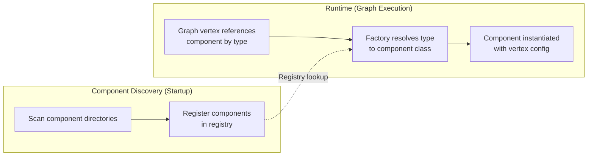
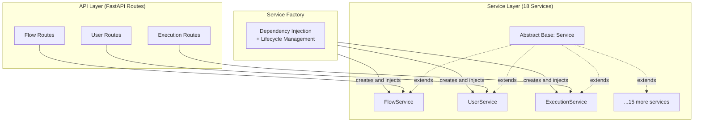
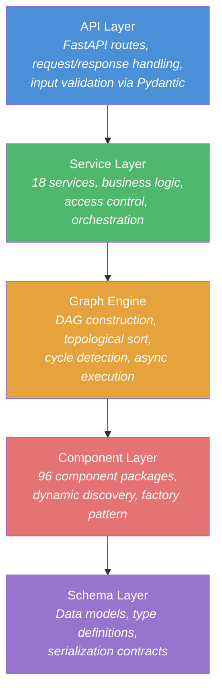
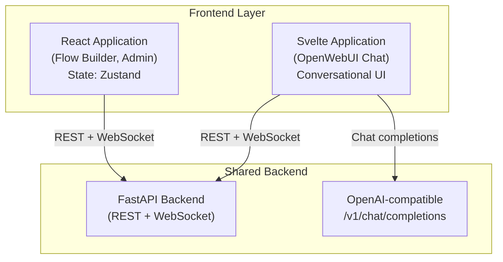
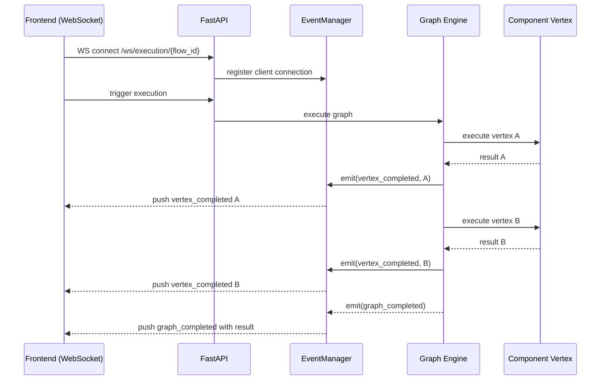
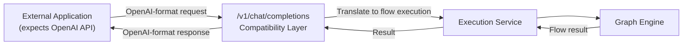

# Architecture Patterns and Design Principles

> Generated: 2026-02-09 | LangBuilder v1.6.5

This document catalogs the key architecture patterns employed in the LangBuilder platform and the design principles that guide its evolution. Each pattern includes a description, its location within the codebase, and the benefits it provides.

---

## Table of Contents

- [Architecture Patterns](#architecture-patterns)
  - [Plugin / Component System](#plugin--component-system)
  - [Graph-Based Execution Engine](#graph-based-execution-engine)
  - [Service-Oriented Architecture](#service-oriented-architecture)
  - [Layered Architecture](#layered-architecture)
  - [Dual Frontend Strategy](#dual-frontend-strategy)
  - [Event-Driven Communication](#event-driven-communication)
  - [OpenAI API Compatibility Layer](#openai-api-compatibility-layer)
- [Design Principles](#design-principles)
  - [Plugin-First](#plugin-first)
  - [Async-First](#async-first)
  - [LangChain Ecosystem Alignment](#langchain-ecosystem-alignment)
  - [Convention over Configuration](#convention-over-configuration)

---

## Architecture Patterns

### Plugin / Component System

**Pattern:** Plugin Architecture with Factory-based Dynamic Loading

**Description:**
LangBuilder's core extensibility is achieved through a plugin/component system that manages 96 component packages. Components are self-contained units that encapsulate a specific capability (e.g., an LLM provider, a vector store, a text splitter). At startup, the component discovery system dynamically scans designated component directories, registers discovered components, and makes them available to the graph execution engine through a factory pattern.

Each component package follows a consistent structure: a module with a defined interface, typed input/output schemas, and metadata for the UI. The factory pattern decouples component instantiation from the graph engine, allowing new components to be added without modifying engine code.

**Location:**
- Component packages: `src/backend/langbuilder/components/`
- Component discovery and registration: `src/backend/langbuilder/components/` (discovery module)
- Factory instantiation: integrated within the graph execution engine

**How it works:**

**Benefits:**
- **Extensibility:** Adding a new component requires only creating a new package in the components directory. No changes to the engine or API layer.
- **Isolation:** Each component is self-contained. A failure in one component does not affect others.
- **Discoverability:** The dynamic scanning means components are automatically available after being placed in the correct directory.
- **Testability:** Components can be unit tested in isolation from the graph engine.

---

### Graph-Based Execution Engine

**Pattern:** Directed Acyclic Graph (DAG) Execution with Topological Ordering

**Description:**
The execution engine at the heart of LangBuilder models workflows as directed acyclic graphs (DAGs). Each vertex in the graph represents a component instance, and edges represent data flow between components. Before execution, the engine performs topological sorting to determine a valid execution order and cycle detection to reject invalid graphs. Execution proceeds asynchronously, with vertices that have no mutual dependencies executing concurrently.

```mermaid
graph TD
    subgraph GraphDefinition["Graph Definition"]
        V1["Vertex: Input<br/>(TextInput)"]
        V2["Vertex: LLM<br/>(OpenAI GPT)"]
        V3["Vertex: Prompt<br/>(Template)"]
        V4["Vertex: Output<br/>(TextOutput)"]

        V1 -->|"user_text"| V3
        V3 -->|"formatted_prompt"| V2
        V2 -->|"llm_response"| V4
    end

    subgraph Execution["Execution Pipeline"]
        Parse["Parse graph<br/>definition"]
        Validate["Cycle detection +<br/>topological sort"]
        Resolve["Resolve vertices<br/>to components"]
        Execute["Async execution<br/>(respecting order)"]
        Result["Collect results"]

        Parse --> Validate
        Validate --> Resolve
        Resolve --> Execute
        Execute --> Result
    end
```

**Location:**
- Graph engine: `src/backend/langbuilder/graph/`
- Vertex and edge models: `src/backend/langbuilder/graph/`
- Graph state management: `src/backend/langbuilder/graph/`

**Benefits:**
- **Parallelism:** Independent branches of the graph execute concurrently via async, reducing total execution time.
- **Correctness:** Topological sorting guarantees that a vertex's inputs are ready before it executes. Cycle detection prevents infinite loops.
- **Transparency:** The graph structure is inspectable, serializable, and renderable in the UI, giving users a clear mental model of their workflow.
- **Composability:** Complex workflows are composed from simple, reusable components connected by edges.

---

### Service-Oriented Architecture

**Pattern:** Abstract Service Layer with Dependency Injection

**Description:**
LangBuilder organizes its business logic into 18 services, each responsible for a distinct domain (e.g., flow management, user management, execution orchestration). All services extend an abstract base `Service` class that defines a consistent interface. Service instances are created and wired together via a factory that handles dependency injection, ensuring that services can depend on each other without circular import issues or tight coupling.

**Location:**
- Service base class and factory: `src/backend/langbuilder/services/`
- Individual service implementations: `src/backend/langbuilder/services/`
- API route handlers: `src/backend/langbuilder/api/`

**Benefits:**
- **Separation of concerns:** Business logic is cleanly separated from HTTP handling and data access.
- **Testability:** Services can be tested with mocked dependencies injected via the factory.
- **Consistency:** The abstract base class enforces a uniform interface across all services.
- **Maintainability:** Changes to one service's internals do not ripple through unrelated code.

---

### Layered Architecture

**Pattern:** Strict Layered Architecture with Unidirectional Dependencies

**Description:**
LangBuilder follows a layered architecture where each layer depends only on the layer directly below it. This creates a clear separation of responsibilities and prevents circular dependencies.

**Dependency rules:**

| Layer           | May Depend On                        | Must Not Depend On            |
|-----------------|--------------------------------------|-------------------------------|
| API Layer       | Service Layer, Schema Layer          | Graph Engine, Component Layer |
| Service Layer   | Graph Engine, Schema Layer           | API Layer                     |
| Graph Engine    | Component Layer, Schema Layer        | API Layer, Service Layer      |
| Component Layer | Schema Layer                         | All upper layers              |
| Schema Layer    | Nothing (leaf layer)                 | All upper layers              |

**Benefits:**
- **Predictability:** Developers know exactly where to find and place code based on its responsibility.
- **Testability:** Each layer can be tested independently by mocking the layer below.
- **Replaceability:** An entire layer can be swapped without affecting layers above (e.g., changing the database engine only affects the data access code in the service layer).

---

### Dual Frontend Strategy

**Pattern:** Multi-Frontend Architecture with Shared Backend

**Description:**
LangBuilder serves two distinct frontend applications from the same backend:

1. **React application (main UI):** The primary interface for building, managing, and executing flows. Provides the visual graph editor, component palette, and administration panels. State management is handled with Zustand.

2. **Svelte application (OpenWebUI chat):** A chat-oriented interface powered by OpenWebUI that provides a conversational interaction model. Suited for end users who consume flows via a chat interface rather than building them.

Both frontends communicate with the same FastAPI backend, share the same authentication system, and operate on the same data.

**Location:**
- React frontend: `src/frontend/`
- Svelte frontend (OpenWebUI): `src/backend/open_webui/` (served as part of the backend)
- Shared API: `src/backend/langbuilder/api/`

**Benefits:**
- **Audience-specific UX:** Builders get a visual DAG editor; end users get a simple chat interface.
- **Code reuse:** Both frontends share the same backend services, authentication, and data layer.
- **Incremental adoption:** Organizations can expose only the chat interface to end users while giving developers access to the full builder.

---

### Event-Driven Communication

**Pattern:** Event Manager with WebSocket Push

**Description:**
Graph execution emits events at key lifecycle points (vertex started, vertex completed, execution error, graph completed). The `EventManager` captures these events and, when a WebSocket connection is active, pushes real-time updates to the connected client. This enables the React frontend to show live execution progress in the graph editor.

**Location:**
- EventManager: `src/backend/langbuilder/graph/` (event handling module)
- WebSocket endpoints: `src/backend/langbuilder/api/`

**Benefits:**
- **Real-time feedback:** Users see execution progress live without polling.
- **Decoupled execution:** The graph engine emits events without knowing who consumes them. The EventManager handles routing.
- **Debuggability:** Event streams provide a complete trace of execution for debugging and auditing.

---

### OpenAI API Compatibility Layer

**Pattern:** Protocol Adapter / Facade

**Description:**
LangBuilder exposes a `/v1/chat/completions` endpoint that conforms to the OpenAI Chat Completions API specification. This allows LangBuilder flows to be used as drop-in replacements for OpenAI models in any application that supports the OpenAI API format. The compatibility layer translates incoming chat completion requests into flow executions and formats the results back into the OpenAI response schema.

**Location:**
- Compatibility endpoint: `src/backend/langbuilder/api/` (v1 chat completions route)

**Benefits:**
- **Ecosystem compatibility:** Any tool, library, or application that integrates with the OpenAI API can use LangBuilder flows without modification.
- **Migration path:** Organizations using OpenAI directly can gradually move to LangBuilder-hosted flows without changing client code.
- **Svelte chat integration:** The OpenWebUI Svelte frontend uses this endpoint natively, treating LangBuilder flows as if they were LLM models.

---

## Design Principles

### Plugin-First

> Every new capability should be a component, not a change to the core.

The component system is the primary extension mechanism. When adding support for a new LLM provider, a new vector store, or a new data transformation, the correct approach is to create a new component package in the components directory. The core engine, API layer, and service layer should rarely need modification for new capabilities.

**Implications:**
- The component interface must remain stable. Breaking changes to the component contract affect all 96 packages.
- The discovery system must be robust enough to handle malformed or incompatible components gracefully (fail-open at discovery, fail-closed at execution).
- Documentation and tooling should make it straightforward to scaffold a new component package.

### Async-First

> All I/O-bound operations are async. Synchronous I/O is treated as a bug.

LangBuilder is built on FastAPI and Python's `asyncio` runtime. Network calls, database queries, file reads, and inter-service communication are all performed asynchronously. The graph execution engine leverages this to run independent vertices concurrently, and the WebSocket event system depends on non-blocking I/O to push updates while execution continues.

**Implications:**
- All component implementations must use async interfaces for any I/O operations.
- Blocking calls (e.g., `requests.get()` instead of `httpx` async) will block the event loop and degrade performance for all concurrent users.
- Testing must account for async execution, using `pytest-asyncio` or equivalent.

### LangChain Ecosystem Alignment

> Align with LangChain primitives and conventions wherever possible.

LangBuilder's component model is designed to wrap and expose LangChain components (LLMs, chains, retrievers, embeddings, vector stores, etc.) as graph vertices. This means:

- Component input/output types should map naturally to LangChain's type system.
- Component names and parameter schemas should be familiar to developers who know LangChain.
- New LangChain integrations should be adoptable as LangBuilder components with minimal wrapper code.

**Implications:**
- LangBuilder's schema layer should track LangChain's evolving type system.
- Breaking changes in LangChain may require coordinated updates across multiple component packages.
- The component interface should not be so tightly coupled to LangChain that non-LangChain components are impossible; it should accommodate custom implementations too.

### Convention over Configuration

> Reduce the amount of explicit configuration by establishing and following consistent conventions.

LangBuilder minimizes boilerplate by relying on conventions:

- **Component discovery:** Components are discovered by their location in the directory tree, not by explicit registration in a configuration file.
- **Schema inference:** Component input/output schemas are inferred from type annotations where possible.
- **Service registration:** Services follow a naming convention and are auto-wired by the factory.
- **API route organization:** Routes are organized by resource type and follow RESTful conventions.

**Implications:**
- Conventions must be well documented. A convention that is not known is indistinguishable from magic.
- When a convention is insufficient, explicit configuration must be available as an escape hatch.
- New developers should be able to add a component by following the existing directory structure and naming patterns without reading a setup guide.
