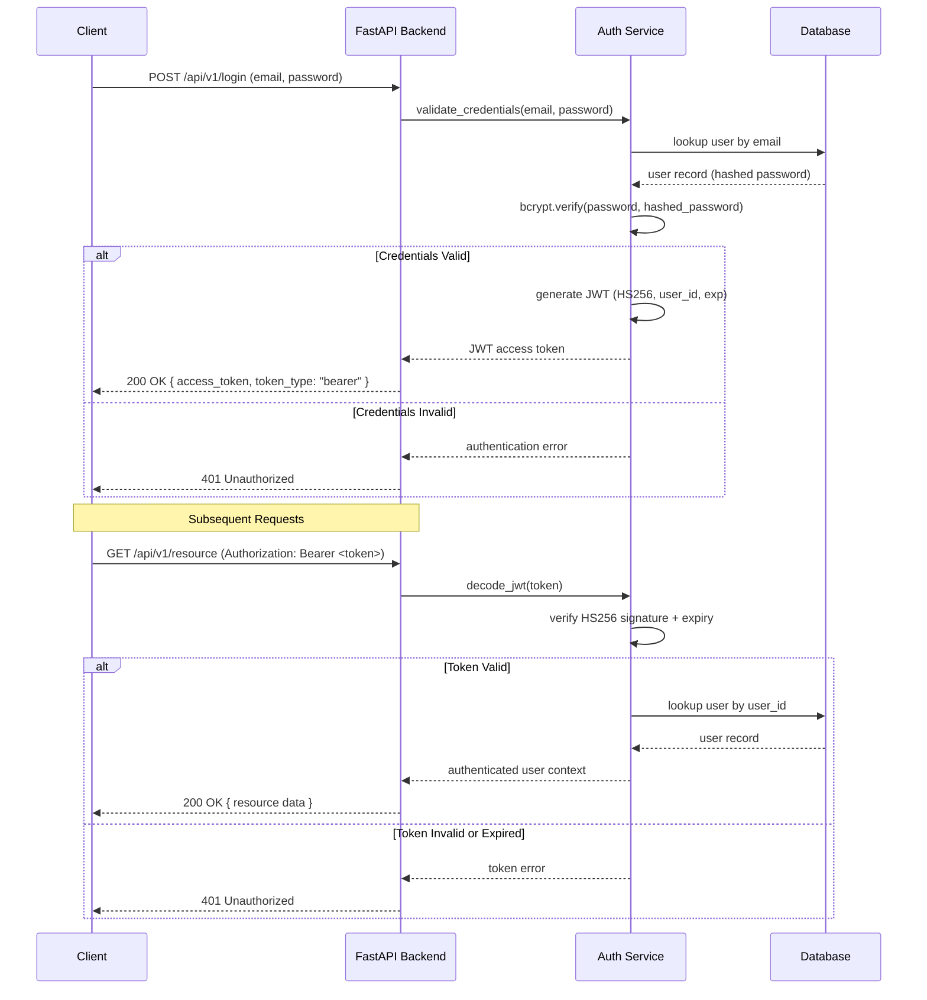
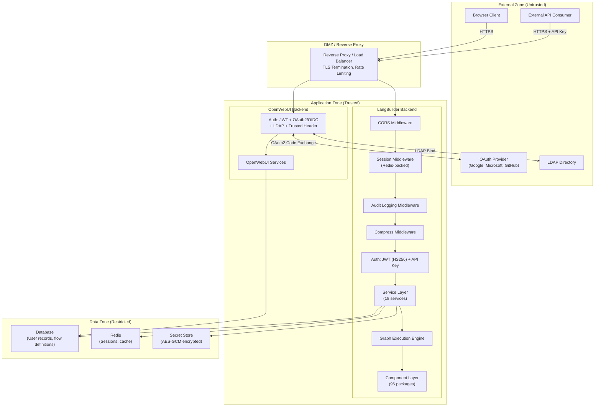

# Security Architecture

> Generated: 2026-02-09 | LangBuilder v1.6.5

This document describes the security architecture of the LangBuilder platform, covering authentication mechanisms, authorization models, secret management, and security controls across both the LangBuilder backend and the integrated OpenWebUI backend.

---

## Table of Contents

- [Authentication](#authentication)
  - [JWT Authentication Flow](#jwt-authentication-flow)
  - [OAuth2 / OIDC Authentication](#oauth2--oidc-authentication)
  - [API Key Authentication](#api-key-authentication)
  - [LDAP Authentication](#ldap-authentication)
  - [Trusted Header Authentication](#trusted-header-authentication)
- [Authorization](#authorization)
  - [User Roles and Flags](#user-roles-and-flags)
  - [Flow Access Control](#flow-access-control)
- [Security Boundaries](#security-boundaries)
- [Secret Management](#secret-management)
  - [Environment Variables](#environment-variables)
  - [Encryption at Rest](#encryption-at-rest)
  - [Password Hashing](#password-hashing)
  - [Variable Encryption](#variable-encryption)
- [Security Controls](#security-controls)

---

## Authentication

LangBuilder supports multiple authentication mechanisms depending on the entry point and backend involved. The LangBuilder backend uses JWT with HS256 signing and API key authentication. The OpenWebUI backend extends this with OAuth2/OIDC, LDAP, and trusted header authentication.

### JWT Authentication Flow

The primary authentication mechanism for interactive users is JWT token-based authentication. Passwords are hashed with bcrypt before storage. Tokens are signed using HS256 (HMAC-SHA256).



**Key properties of the JWT flow:**

- **Signing algorithm:** HS256 (HMAC with SHA-256)
- **Password storage:** bcrypt hash (adaptive cost factor)
- **Token lifetime:** Configurable expiration via environment variables
- **Token transport:** Bearer token in the `Authorization` header

### OAuth2 / OIDC Authentication

The OpenWebUI backend supports external identity providers through OAuth2 and OpenID Connect. Provider integration is handled via the `authlib` library.

| Provider  | Protocol     | Library  |
|-----------|-------------|----------|
| Google    | OAuth2/OIDC | authlib  |
| Microsoft | OAuth2/OIDC | authlib  |
| GitHub    | OAuth2      | authlib  |

The OAuth2 flow follows the standard authorization code grant:

1. The client initiates login by selecting a provider.
2. The backend redirects to the provider's authorization endpoint.
3. The user authenticates with the external provider.
4. The provider redirects back with an authorization code.
5. The backend exchanges the code for an access token and ID token.
6. User identity is extracted from the ID token (OIDC) or userinfo endpoint.
7. A local user record is created or matched, and a LangBuilder JWT is issued.

### API Key Authentication

For programmatic and service-to-service access, LangBuilder supports API key authentication.

- **Format:** `sk-{uuid}` (e.g., `sk-550e8400-e29b-41d4-a716-446655440000`)
- **Transport:** Sent via `Authorization: Bearer sk-{uuid}` header or dedicated `x-api-key` header
- **Storage:** API keys are stored as hashed values in the database
- **Scope:** Each key is bound to a specific user account and inherits that user's permissions

API keys are intended for automation, CI/CD pipelines, and external integrations where interactive login is not practical.

### LDAP Authentication

The OpenWebUI backend supports LDAP bind authentication for enterprise environments. When enabled, user credentials are verified against the configured LDAP directory server. On successful bind, a local user record is provisioned or updated, and a JWT is issued.

### Trusted Header Authentication

For deployments behind a reverse proxy that handles authentication (e.g., Authelia, Authentik, or cloud IAP), the OpenWebUI backend supports trusted header authentication. The proxy sets a header (e.g., `X-Forwarded-User`) containing the authenticated user identity, and the backend trusts that header when the request originates from an allowed source.

**Warning:** Trusted header authentication must only be enabled when the backend is exclusively accessible through the authenticating proxy. Direct client access to the backend bypasses this mechanism entirely.

---

## Authorization

### User Roles and Flags

Authorization in LangBuilder is controlled through flags on the user model:

| Flag           | Type    | Description                                                        |
|----------------|---------|--------------------------------------------------------------------|
| `is_active`    | Boolean | Controls whether the user can authenticate at all. Inactive users are denied access regardless of other flags. |
| `is_superuser` | Boolean | Grants full administrative privileges. Superusers bypass all access control checks and can manage all resources. |

The effective permission model is:

```
if not user.is_active:
    DENY all access

if user.is_superuser:
    ALLOW all access

otherwise:
    apply resource-level access control
```

### Flow Access Control

Individual flows (the primary executable artifact in LangBuilder) have an access control type defined by `AccessTypeEnum`:

| Access Type | Behavior                                                                |
|-------------|-------------------------------------------------------------------------|
| `PRIVATE`   | Only the flow owner and superusers can view, edit, or execute the flow. |
| `PUBLIC`    | Any active, authenticated user can view and execute the flow.           |

Access checks are enforced at the service layer before any operation on a flow is performed.

---

## Security Boundaries

The following diagram shows the trust boundaries and security zones within a LangBuilder deployment.



**Trust boundary transitions:**

1. **External to DMZ:** TLS termination and rate limiting at the reverse proxy.
2. **DMZ to Application:** CORS enforcement, session validation, audit logging, and authentication.
3. **Application to Data:** Access mediated exclusively through the service layer. No direct database access from API handlers or components.

---

## Secret Management

### Environment Variables

Runtime secrets and configuration values are provided via environment variables. These include:

- JWT signing secret
- Database connection strings
- Redis connection strings
- OAuth client IDs and client secrets
- LDAP bind credentials
- Encryption keys for secret storage

Environment variables are never logged, never included in API responses, and are loaded once at application startup.

### Encryption at Rest

Stored secrets (such as credentials for external services configured within flows) are encrypted using **AES-GCM** (Galois/Counter Mode), which provides both confidentiality and integrity. Cryptographic signatures use **Ed25519** for non-repudiation, and data integrity verification uses **HMAC-SHA256**.

| Primitive     | Algorithm   | Purpose                                      |
|---------------|-------------|----------------------------------------------|
| Encryption    | AES-GCM     | Encrypt stored secrets and sensitive values   |
| Signing       | Ed25519     | Digital signatures for integrity verification |
| Verification  | HMAC-SHA256 | Message authentication and tamper detection   |

### Password Hashing

User passwords are hashed with **bcrypt** before storage. Bcrypt provides:

- Adaptive cost factor (configurable work factor that increases computational cost)
- Built-in salt generation (each hash includes a unique random salt)
- Resistance to rainbow table and brute-force attacks

Plaintext passwords are never stored, logged, or transmitted after initial receipt.

### Variable Encryption

LangBuilder supports encrypted variables within flow definitions. When a component parameter is marked as a secret (e.g., API keys for third-party services), the value is encrypted before being persisted to the database. Decryption occurs at runtime within the graph execution engine, and decrypted values are held only in memory for the duration of execution.

---

## Security Controls

The following table summarizes the security controls in place across the middleware stack and application layer.

| Control                | Implementation                        | Layer               | Description                                                                                              |
|------------------------|---------------------------------------|----------------------|----------------------------------------------------------------------------------------------------------|
| **CORS**               | `CORSMiddleware`                      | Middleware           | Configurable allowed origins, all methods and headers permitted. Origins are set via environment config.  |
| **Session Management** | `SessionMiddleware` + `StarSessionsMiddleware` | Middleware  | Server-side sessions backed by Redis. Session data is not stored in the client cookie.                   |
| **Audit Logging**      | `AuditLoggingMiddleware`              | Middleware           | Logs authentication events, access control decisions, and significant state changes for forensic review.  |
| **Response Compression** | `CompressMiddleware`                | Middleware           | Compresses response bodies. Applied after security middleware to avoid compressing before encryption.     |
| **TLS**                | Reverse proxy                         | Infrastructure       | All external traffic encrypted in transit via HTTPS. TLS terminated at the reverse proxy.                |
| **Password Policy**    | bcrypt hashing                        | Application          | Passwords hashed with bcrypt. Adaptive cost factor defends against brute-force attacks.                  |
| **Token Expiry**       | JWT `exp` claim                       | Application          | Access tokens have a configurable maximum lifetime. Expired tokens are rejected.                         |
| **API Key Format**     | `sk-{uuid}`                           | Application          | Predictable format enables detection and secret scanning in source code and logs.                        |
| **Input Validation**   | Pydantic models                       | API Layer            | Request bodies validated against typed schemas before reaching business logic.                            |
| **Access Control**     | `AccessTypeEnum` (PRIVATE/PUBLIC)     | Service Layer        | Per-flow access control enforced before any read, write, or execute operation.                            |
| **Secret Encryption**  | AES-GCM                               | Data Layer           | Sensitive values encrypted at rest. Decrypted only in memory during execution.                           |
| **Integrity Checks**   | Ed25519 + HMAC-SHA256                 | Data Layer           | Signatures and MACs verify that stored data has not been tampered with.                                  |

### Middleware Execution Order

Requests pass through the middleware stack in the following order:

1. **CORS Middleware** -- Rejects disallowed cross-origin requests before any processing.
2. **Session Middleware (Redis)** -- Establishes or resumes a server-side session.
3. **Audit Logging Middleware** -- Records the request for audit trail purposes.
4. **Compress Middleware** -- Handles response compression.
5. **Authentication** -- JWT or API key validation. Unauthenticated requests are rejected.
6. **Route Handler** -- The FastAPI endpoint processes the request through the service layer.
