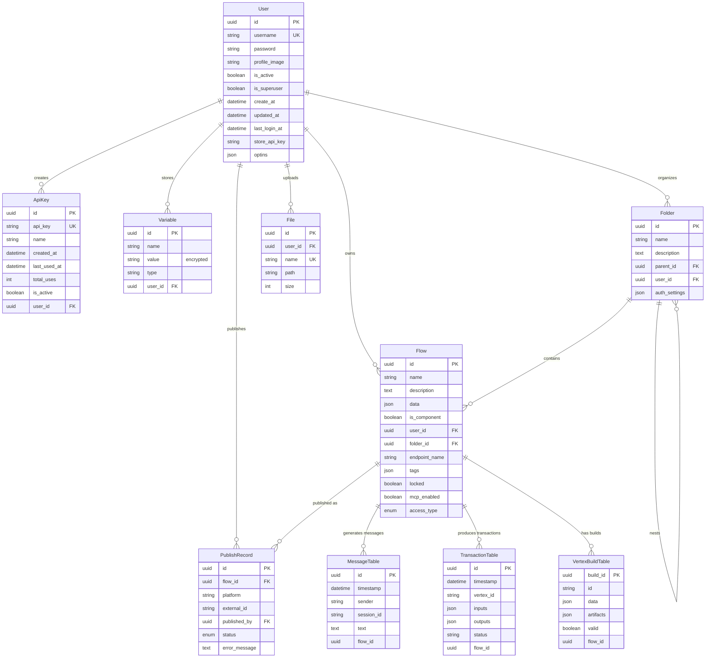

# Business Model - LangBuilder v1.6.5

> Generated: 2026-02-09 | LangBuilder v1.6.5

## Overview

This document describes the core domain entities, business rules, entity relationships, and operational workflows that define how LangBuilder operates as a product. All entity definitions, attributes, constraints, and relationships are derived directly from the database models and service-layer logic in the codebase.

---

## Core Business Entities

### 1. User `[CODE]`

The identity entity. Represents a person or service account that interacts with LangBuilder through the UI or API.

**Source:** `langbuilder/src/backend/base/langbuilder/services/database/models/`

| Attribute | Type | Constraints | Description |
|-----------|------|-------------|-------------|
| id | UUID | Primary key | Unique identifier |
| username | str | Indexed, unique | Login identifier and display name |
| password | str | Required | bcrypt-hashed credential |
| profile_image | str | Nullable | Avatar image path |
| is_active | bool | Default: `True` | Account status flag; inactive users are denied all access |
| is_superuser | bool | Default: `False` | Administrative privilege flag; superusers bypass all access control |
| create_at | datetime | Default: `now()` | Account creation timestamp |
| updated_at | datetime | Default: `now()` | Last modification timestamp |
| last_login_at | datetime | Nullable | Most recent login timestamp |
| store_api_key | str | Nullable | Personal API key for the LangBuilder component store |
| optins | JSON | Nullable | User preference and opt-in flags |

**Relationships:** Owns many Flows, ApiKeys, Variables, Folders, and Files.

**Lifecycle:**
1. **Created** via registration endpoint or superuser provisioning
2. **Active** with `is_active=True` -- can authenticate and operate
3. **Deactivated** with `is_active=False` -- denied all access without deletion
4. **Deleted** -- cascades to all owned resources (flows, keys, variables, folders)

---

### 2. Flow `[CODE]`

The central business entity. An AI workflow definition consisting of a directed acyclic graph (DAG) of connected components. Flows are the primary artifact that users create, configure, execute, and publish.

| Attribute | Type | Constraints | Description |
|-----------|------|-------------|-------------|
| id | UUID | Primary key | Unique identifier |
| name | str | Indexed | Human-readable flow name |
| description | Text | Nullable | Purpose and documentation |
| icon | str | Nullable | Visual icon identifier |
| icon_bg_color | str | Nullable | Icon background color |
| gradient | str | Nullable | UI gradient theme |
| data | JSON | Required | Complete graph definition (nodes, edges, parameters) |
| is_component | bool | Nullable | Whether this flow is a reusable component |
| updated_at | datetime | Nullable | Last modification timestamp |
| user_id | UUID | FK(user.id), nullable | Owner reference |
| folder_id | UUID | FK(folder.id), nullable, indexed | Parent folder/project |
| fs_path | str | Nullable | File system path for file-backed flows |
| webhook | bool | Nullable | Whether webhook execution is enabled |
| endpoint_name | str | Nullable, indexed | Custom API endpoint identifier |
| tags | JSON list | -- | Classification tags (CHATBOTS, AGENTS) |
| locked | bool | Nullable | Whether the flow is locked for editing |
| mcp_enabled | bool | Nullable | Whether MCP (Model Context Protocol) exposure is enabled |
| action_name | str | Nullable | MCP action name |
| action_description | Text | Nullable | MCP action description |
| access_type | AccessTypeEnum | Default: `PRIVATE` | Access control level (PRIVATE or PUBLIC) |

**Constraints:**
- `UNIQUE(user_id, name)` -- Flow names must be unique per user workspace
- `UNIQUE(user_id, endpoint_name)` -- Endpoint names must be unique per user

**Relationships:** Belongs to one User, optionally belongs to one Folder. Has many PublishRecords.

**Lifecycle:**
1. **Created** -- User drags components onto canvas, connects edges, saves
2. **Configured** -- Components parameterized with credentials, prompts, model selections
3. **Validated** -- System checks graph structure, component compatibility, required inputs
4. **Executed** -- Graph engine builds components in dependency order, produces outputs
5. **Published** -- Optionally exported to OpenWebUI or exposed via API/webhook/MCP
6. **Archived/Deleted** -- Removed from workspace; cascades to build records and transactions

---

### 3. Folder `[CODE]`

Organizational container for grouping flows and projects. Supports hierarchical nesting via self-referential parent relationship.

| Attribute | Type | Constraints | Description |
|-----------|------|-------------|-------------|
| id | UUID | Primary key | Unique identifier |
| name | str | Indexed | Folder display name |
| description | Text | Nullable | Folder purpose |
| parent_id | UUID | FK(folder.id), nullable | Parent folder for nesting |
| user_id | UUID | FK(user.id), nullable | Owner reference |
| auth_settings | JSON | Nullable | Per-folder authentication configuration |

**Constraints:** `UNIQUE(user_id, name)` -- Folder names must be unique per user

**Relationships:** Belongs to one User. Self-referential: has one optional Parent, has many Children. Contains many Flows.

**Lifecycle:**
1. **Created** -- User creates folder/project for organization
2. **Populated** -- Flows moved or created within the folder
3. **Nested** -- Subfolder created under parent
4. **Exported** -- Folder contents downloaded as backup
5. **Deleted** -- Cascades to or orphans contained flows (depending on operation)

---

### 4. ApiKey `[CODE]`

Authentication credential for programmatic and service-to-service access. Each key is bound to a specific user and inherits that user's permissions.

| Attribute | Type | Constraints | Description |
|-----------|------|-------------|-------------|
| id | UUID | Primary key | Unique identifier |
| api_key | str | Indexed, unique | Hashed key value (format: `sk-{uuid}`) |
| name | str | Indexed, nullable | Human-readable label |
| created_at | datetime | Default: `now()` | Creation timestamp |
| last_used_at | datetime | Nullable | Most recent usage timestamp |
| total_uses | int | Default: `0` | Cumulative usage counter |
| is_active | bool | Default: `True` | Key status; inactive keys are rejected |
| user_id | UUID | FK(user.id), indexed | Owner reference |

**Relationships:** Belongs to one User.

**Lifecycle:**
1. **Generated** -- System creates `sk-{uuid}` format key, hashes for storage
2. **Displayed** -- Unhashed key shown to user exactly once at creation
3. **Active** -- Used for API authentication; usage tracked
4. **Deactivated** -- `is_active=False`; key rejected without deletion
5. **Deleted** -- Permanently removed from database

---

### 5. Variable `[CODE]`

Encrypted storage for sensitive credentials and configuration values. Variables allow users to securely reference API keys, tokens, and secrets within flow configurations without exposing plaintext values.

| Attribute | Type | Constraints | Description |
|-----------|------|-------------|-------------|
| id | UUID | Primary key | Unique identifier |
| name | str | Required | Variable name (referenced in flow configs) |
| value | str | Encrypted (AES-GCM) | Encrypted secret value |
| type | str | Nullable | Variable classification |
| default_fields | JSON list | Nullable | Default field mappings |
| created_at | datetime | Default: `now()` | Creation timestamp |
| updated_at | datetime | Nullable | Last modification timestamp |
| user_id | UUID | FK(user.id) | Owner reference |

**Relationships:** Belongs to one User.

**Lifecycle:**
1. **Created** -- User provides name and value; value encrypted with AES-GCM before storage
2. **Referenced** -- Variable name used in flow component configuration
3. **Decrypted at runtime** -- Graph engine decrypts value in memory during execution
4. **Updated** -- New value encrypted and stored; old value overwritten
5. **Deleted** -- Encrypted value removed from database

**Security rules `[CODE]`:**
- Values encrypted at rest with AES-GCM (Galois/Counter Mode)
- Values never exposed in API responses (only names returned)
- Values never written to logs
- Decrypted values held only in memory for execution duration

---

### 6. MessageTable `[CODE]`

Conversation messages generated during flow executions, particularly for chat-type flows. Enables conversation history and session continuity.

| Attribute | Type | Constraints | Description |
|-----------|------|-------------|-------------|
| id | UUID | Primary key | Unique identifier |
| timestamp | datetime | Default: `now()` | Message creation time |
| sender | str | Required | Message origin identifier (user/ai) |
| sender_name | str | Required | Display name of sender |
| session_id | str | Required | Conversation session identifier |
| text | Text | Required | Message content |
| files | JSON list | -- | Attached file references |
| error | bool | Default: `False` | Whether this message represents an error |
| edit | bool | Default: `False` | Whether this message was edited |
| flow_id | UUID | Nullable | Associated flow identifier |
| properties | JSON | -- | Additional message metadata |
| category | Text | -- | Message classification |
| content_blocks | JSON list | -- | Structured content blocks |

**Table name:** `message`

**Lifecycle:**
1. **Created** -- Generated during flow execution (user input or AI response)
2. **Stored** -- Persisted with session_id for conversation continuity
3. **Retrieved** -- Loaded to rebuild conversation context for subsequent turns
4. **Updated** -- Message content or properties modified
5. **Deleted** -- Removed individually or by session

---

### 7. TransactionTable `[CODE]`

Execution audit trail. Every flow execution creates transaction records that capture inputs, outputs, status, and errors for debugging and compliance.

| Attribute | Type | Constraints | Description |
|-----------|------|-------------|-------------|
| id | UUID | Primary key | Unique identifier |
| timestamp | datetime | Default: `now()` | Execution timestamp |
| vertex_id | str | Required | Component (vertex) identifier within the flow |
| target_id | str | Nullable | Target component identifier |
| inputs | JSON | Nullable | Execution inputs |
| outputs | JSON | Nullable | Execution outputs |
| status | str | Required | Execution status |
| error | str | Nullable | Error details if execution failed |
| flow_id | UUID | Required | Associated flow identifier |

**Table name:** `transaction`

**Lifecycle:**
1. **Created** -- Automatically generated when a flow component executes
2. **Populated** -- Inputs, outputs, and status recorded after execution
3. **Queried** -- Retrieved for debugging, monitoring, or audit purposes
4. **Cleaned up** -- Optionally purged based on retention policy

---

### 8. VertexBuildTable `[CODE]`

Individual component build results within a flow execution. Tracks the build state, outputs, and artifacts of each vertex (component) in the workflow graph.

| Attribute | Type | Constraints | Description |
|-----------|------|-------------|-------------|
| build_id | UUID | Primary key | Unique build identifier |
| id | str | Required | Vertex (component) identifier |
| timestamp | datetime | Default: `now()` | Build timestamp |
| data | JSON | Nullable | Build output data |
| artifacts | JSON | Nullable | Build artifacts (intermediate results) |
| params | Text | Nullable | Build parameters |
| valid | bool | Required | Whether the build succeeded |
| flow_id | UUID | Required | Associated flow identifier |

**Table name:** `vertex_build`

**Lifecycle:**
1. **Created** -- Initiated when graph engine begins building a vertex
2. **Completed** -- `valid=True` with data and artifacts populated
3. **Failed** -- `valid=False` with error information
4. **Superseded** -- New build replaces previous for same vertex/flow
5. **Cleaned up** -- Old builds purged via monitor endpoints

---

### 9. File `[CODE]`

User-uploaded files for processing within flow executions. Supports document ingestion, image processing, and data import workflows.

| Attribute | Type | Constraints | Description |
|-----------|------|-------------|-------------|
| id | UUID | Primary key | Unique identifier |
| user_id | UUID | FK(user.id) | Owner reference |
| name | str | Unique | File name |
| path | str | Required | Storage path on disk or object store |
| size | int | Required | File size in bytes |
| provider | str | Nullable | Storage provider identifier |
| created_at | datetime | Default: `now()` | Upload timestamp |
| updated_at | datetime | Default: `now()` | Last modification timestamp |

**Relationships:** Belongs to one User.

**Lifecycle:**
1. **Uploaded** -- User uploads file via V1 (flow-scoped) or V2 (user-scoped) endpoint
2. **Stored** -- Persisted to configured storage backend
3. **Referenced** -- Used as input in flow execution
4. **Renamed** -- File name updated via V2 API
5. **Deleted** -- Removed from storage and database

---

### 10. PublishRecord `[CODE]`

Tracking entity for flows published to external platforms (primarily OpenWebUI). Maintains synchronization state between LangBuilder and the target platform.

| Attribute | Type | Constraints | Description |
|-----------|------|-------------|-------------|
| id | UUID | Primary key | Unique identifier |
| flow_id | UUID | FK(flow.id), indexed | Published flow reference |
| platform | str | Indexed | Target platform identifier |
| platform_url | str | Required | Target platform URL |
| external_id | str | Required | Identifier on the external platform |
| published_at | datetime | Default: `now()` | Publication timestamp |
| published_by | UUID | FK(user.id) | User who published |
| status | PublishStatusEnum | Default: `ACTIVE` | Current publication status |
| metadata_ | JSON | Nullable | Additional platform-specific metadata |
| last_sync_at | datetime | Nullable | Last synchronization timestamp |
| error_message | Text | Nullable | Error details if publication failed |

**Constraints:** `UNIQUE(flow_id, platform, platform_url, status)` -- Prevents duplicate active publications

**Relationships:** Belongs to one Flow and one User (publisher).

**Lifecycle:**
1. **Created** -- User publishes flow to OpenWebUI; record created with status `PENDING`
2. **Active** -- External platform confirms registration; status set to `ACTIVE`
3. **Error** -- Publication fails; status set to `ERROR` with error_message
4. **Unpublished** -- User removes publication; status set to `UNPUBLISHED`
5. **Re-published** -- New record created for updated publication

---

## Business Enums `[CODE]`

### AccessTypeEnum

Controls per-flow visibility and access.

| Value | Behavior |
|-------|----------|
| `PRIVATE` | Only the flow owner and superusers can view, edit, or execute the flow |
| `PUBLIC` | Any active authenticated user can view and execute the flow; anonymous users can read via the public endpoint |

**Used in:** Flow model (`access_type` field)

### PublishStatusEnum

Tracks the lifecycle state of a flow publication to an external platform.

| Value | Description |
|-------|-------------|
| `ACTIVE` | Flow is live and accessible on the external platform |
| `UNPUBLISHED` | Flow has been removed from the external platform |
| `ERROR` | Publication failed; see `error_message` for details |
| `PENDING` | Publication in progress; awaiting confirmation |

**Used in:** PublishRecord model (`status` field)

### Tags

Classification tags for flow categorization.

| Value | Description |
|-------|-------------|
| `CHATBOTS` | Conversational AI workflows |
| `AGENTS` | Autonomous agent workflows |

**Used in:** Flow model (`tags` field as JSON list)

---

## Business Rules & Constraints `[CODE]`

### Authentication Rules

| ID | Rule | Implementation |
|----|------|---------------|
| AUTH-001 | Users must authenticate to access protected endpoints | JWT Bearer token or API key required; 131 of 157 endpoints require JWT |
| AUTH-002 | Passwords are hashed before storage | bcrypt with adaptive cost factor; plaintext never stored or logged |
| AUTH-003 | API keys provide stateless programmatic authentication | Format `sk-{uuid}`; hashed in database; resolved to user on each request |
| AUTH-004 | OAuth2 providers handle external identity federation | Google, Microsoft, GitHub via authlib; local user created/matched on first login |
| AUTH-005 | LDAP enables enterprise directory authentication | Bind authentication against configured LDAP server; local user provisioned on success |
| AUTH-006 | Inactive users are denied all access | `is_active=False` checked before any operation regardless of other flags |
| AUTH-007 | Auto-login mode bypasses authentication for single-user deployments | Configurable via environment variable; returns token without credentials |

### Authorization Rules

| ID | Rule | Implementation |
|----|------|---------------|
| AUTHZ-001 | Superusers bypass all access control checks | `is_superuser=True` grants unrestricted access to all resources and operations |
| AUTHZ-002 | Regular users can only access their own resources | Service layer enforces `resource.user_id == current_user.id` for owned entities |
| AUTHZ-003 | PRIVATE flows are invisible to non-owners | `access_type=PRIVATE` restricts all operations to owner and superusers |
| AUTHZ-004 | PUBLIC flows are readable by all authenticated users | `access_type=PUBLIC` allows read and execute by any active user |
| AUTHZ-005 | API Key users inherit the bound user's permissions | Key resolved to user; operations scoped to that user's access level |
| AUTHZ-006 | Only superusers can manage other users | User CRUD endpoints (list, update, reset password, delete) gated by superuser check |

### Data Integrity Rules

| ID | Rule | Implementation |
|----|------|---------------|
| DATA-001 | Flow names are unique per user | `UNIQUE(user_id, name)` constraint on Flow table |
| DATA-002 | Folder names are unique per user | `UNIQUE(user_id, name)` constraint on Folder table |
| DATA-003 | Endpoint names are unique per user | `UNIQUE(user_id, endpoint_name)` constraint on Flow table |
| DATA-004 | Publication records are unique per flow/platform/status | `UNIQUE(flow_id, platform, platform_url, status)` on PublishRecord |
| DATA-005 | API keys are globally unique | `UNIQUE` constraint on `api_key` field |
| DATA-006 | File names are globally unique | `UNIQUE` constraint on `name` field in File table |
| DATA-007 | Foreign key constraints maintain referential integrity | All FK relationships enforced at database level |
| DATA-008 | Timestamps are automatically maintained | `create_at`, `updated_at` fields auto-populated via defaults |

### Security Rules

| ID | Rule | Implementation |
|----|------|---------------|
| SEC-001 | API keys are hashed before storage | Hashed value stored; original shown to user once at creation |
| SEC-002 | Variable values are encrypted at rest | AES-GCM encryption; decrypted only in memory during execution |
| SEC-003 | Secrets are never logged or exposed in API responses | Variable values excluded from serialization; audit middleware excludes sensitive fields |
| SEC-004 | JWT tokens have configurable expiration | `exp` claim enforced; expired tokens rejected |
| SEC-005 | CORS policies restrict cross-origin access | `CORSMiddleware` with configurable allowed origins |
| SEC-006 | Input validation enforced via typed schemas | Pydantic models validate all request bodies before reaching business logic |
| SEC-007 | Digital signatures verify data integrity | Ed25519 signatures and HMAC-SHA256 for tamper detection |

### Flow Execution Rules

| ID | Rule | Implementation |
|----|------|---------------|
| EXEC-001 | Flows are validated before execution | Graph structure, component compatibility, and required inputs checked |
| EXEC-002 | Components build in dependency order | Graph engine resolves DAG topology and processes vertices sequentially |
| EXEC-003 | Failed component builds halt downstream execution | `valid=False` on VertexBuild prevents dependent vertices from executing |
| EXEC-004 | Streaming responses delivered via SSE | Server-Sent Events for real-time output during flow execution |
| EXEC-005 | Every execution creates audit records | TransactionTable and VertexBuildTable entries created for each run |
| EXEC-006 | Execution can be cancelled in progress | Cancel endpoint terminates active build jobs |

---

## Entity Relationships

### Relationship Summary Table `[CODE]`

| From Model | To Model | Relation | Local Field | Foreign Field | Description |
|------------|----------|----------|-------------|---------------|-------------|
| Flow | User | N:1 | user_id | id | Flow owned by user |
| Flow | Folder | N:1 | folder_id | id | Flow organized in folder |
| ApiKey | User | N:1 | user_id | id | Key bound to user |
| Variable | User | N:1 | user_id | id | Variable scoped to user |
| Folder | Folder | N:1 (self) | parent_id | id | Hierarchical nesting |
| Folder | User | N:1 | user_id | id | Folder owned by user |
| File | User | N:1 | user_id | id | File uploaded by user |
| PublishRecord | Flow | N:1 | flow_id | id | Publication of flow |
| PublishRecord | User | N:1 | published_by | id | Published by user |

### Entity-Relationship Diagram `[CODE]`



---

## Business Workflows

### 1. Flow Creation Workflow `[CODE]`

The primary value-creation workflow. Users build AI workflows visually, then save them for execution.

```
Step  Action                              System Behavior
----  ----------------------------------  ------------------------------------------------
1     User opens flow builder canvas      Frontend loads React Flow canvas, component sidebar
2     User drags components from sidebar  Component metadata loaded from 96 packages (12 categories)
3     User configures component params    Parameters validated against component schema
4     User connects components via edges  Edge compatibility checked (input/output type matching)
5     User sets flow metadata             Name, description, tags (CHATBOTS/AGENTS), access_type
6     User saves flow                     POST /api/v1/flows/ with JSON graph definition
7     System validates uniqueness         UNIQUE(user_id, name) constraint enforced
8     System persists to database         Flow record created with data JSON, user_id, folder_id
9     Flow available for execution        Flow appears in user's workspace
```

### 2. Flow Execution Workflow `[CODE]`

The core runtime workflow. Transforms a static flow definition into executed AI pipeline results.

```
Step  Action                              System Behavior
----  ----------------------------------  ------------------------------------------------
1     User initiates execution            UI: POST /api/v1/build/{flow_id}/flow
                                          API: POST /api/v1/run/{flow_id_or_name}
                                          Webhook: POST /api/v1/webhook/{flow_id_or_name}
2     System loads flow definition        Flow.data JSON loaded from database
3     System resolves variables           Encrypted variables decrypted in memory (AES-GCM)
4     System validates graph structure    DAG topology verified, circular deps rejected
5     System determines build order       Vertices sorted by dependency (topological sort)
6     For each vertex (component):
      a. Build component with inputs      Component class instantiated, parameters applied
      b. Execute component logic          LLM call, vector search, API call, etc.
      c. Store VertexBuild record         VertexBuildTable: build_id, data, artifacts, valid
      d. Stream intermediate results      SSE events sent to client (if streaming enabled)
      e. Pass outputs to connected verts  Output data routed via edges to downstream inputs
7     Final output assembled              Last vertex outputs collected as flow result
8     Transaction records created         TransactionTable: inputs, outputs, status, error
9     Message history updated             MessageTable: sender, text, session_id (if chat flow)
10    Result returned to caller           JSON response (sync) or SSE stream (async)
```

### 3. Publishing Workflow `[CODE]`

Exports a LangBuilder flow to an external platform (OpenWebUI) for consumption by end users.

```
Step  Action                              System Behavior
----  ----------------------------------  ------------------------------------------------
1     User selects flow to publish        Flow must be saved and valid
2     User chooses target platform        Currently: OpenWebUI (identified by platform_url)
3     System checks for existing pub      UNIQUE(flow_id, platform, platform_url, status) verified
4     System creates PublishRecord        Status: PENDING; published_by: current_user.id
5     System exports flow in target fmt   Flow definition converted to OpenWebUI function format
6     System calls external platform API  HTTP request to OpenWebUI backend
7a    Success: record updated             Status: ACTIVE; external_id populated; last_sync_at set
7b    Failure: record updated             Status: ERROR; error_message populated
8     User can check status               GET /api/v1/publish/status/{flow_id}
9     User can unpublish                  DELETE /api/v1/publish/openwebui → Status: UNPUBLISHED
```

### 4. API Key Lifecycle Workflow `[CODE]`

Governs creation and usage of programmatic access credentials.

```
Step  Action                              System Behavior
----  ----------------------------------  ------------------------------------------------
1     User requests new API key           POST /api/v1/api_key/ with optional name
2     System generates key                Format: sk-{uuid} (cryptographically random)
3     System hashes key                   Key hashed before database storage
4     Original key returned once          Plaintext key shown in response (never again)
5     User stores key securely            User's responsibility to save the key
6     Key used for API calls              Authorization: Bearer sk-{uuid} on requests
7     System validates key per request    Hashed lookup in ApiKey table
8     Usage tracked                       total_uses incremented, last_used_at updated
9     Key deactivated or deleted          is_active=False (soft) or DELETE (hard removal)
```

### 5. Variable Encryption Workflow `[CODE]`

Secure lifecycle for sensitive credentials stored as encrypted variables.

```
Step  Action                              System Behavior
----  ----------------------------------  ------------------------------------------------
1     User creates variable               POST /api/v1/variables/ with name and value
2     System encrypts value               AES-GCM encryption with platform master key
3     Encrypted value stored              Only encrypted ciphertext in database
4     Variable name available             Name visible in API responses and flow config UI
5     Flow references variable            Component parameter set to variable reference
6     Flow executed                       Graph engine resolves variable reference
7     Value decrypted in memory           AES-GCM decryption; plaintext held only in memory
8     Value passed to component           Credential used for LLM API call, DB connection, etc.
9     Execution completes                 Decrypted value discarded from memory
10    User updates variable               New value encrypted; old ciphertext overwritten
```

---

## Business Metrics `[INFERRED]`

### Operational Metrics (derivable from existing data models)

| Metric | Source Model | Query Pattern |
|--------|-------------|---------------|
| Active Users | User (last_login_at) | Users with login within period |
| Total Flows | Flow (count) | Count of flow records |
| Flows per User | Flow (group by user_id) | Distribution of flow ownership |
| Executions per Day | TransactionTable (timestamp) | Count grouped by date |
| Execution Success Rate | VertexBuildTable (valid) | valid=True / total builds |
| API Key Usage | ApiKey (total_uses) | Sum of total_uses across keys |
| Publication Count | PublishRecord (status=ACTIVE) | Active publications |
| Message Volume | MessageTable (count) | Messages per session/flow |
| Storage Usage | File (size) | Sum of file sizes per user |

---

*Generated by CloudGeometry AIx SDLC - Product Analysis*
