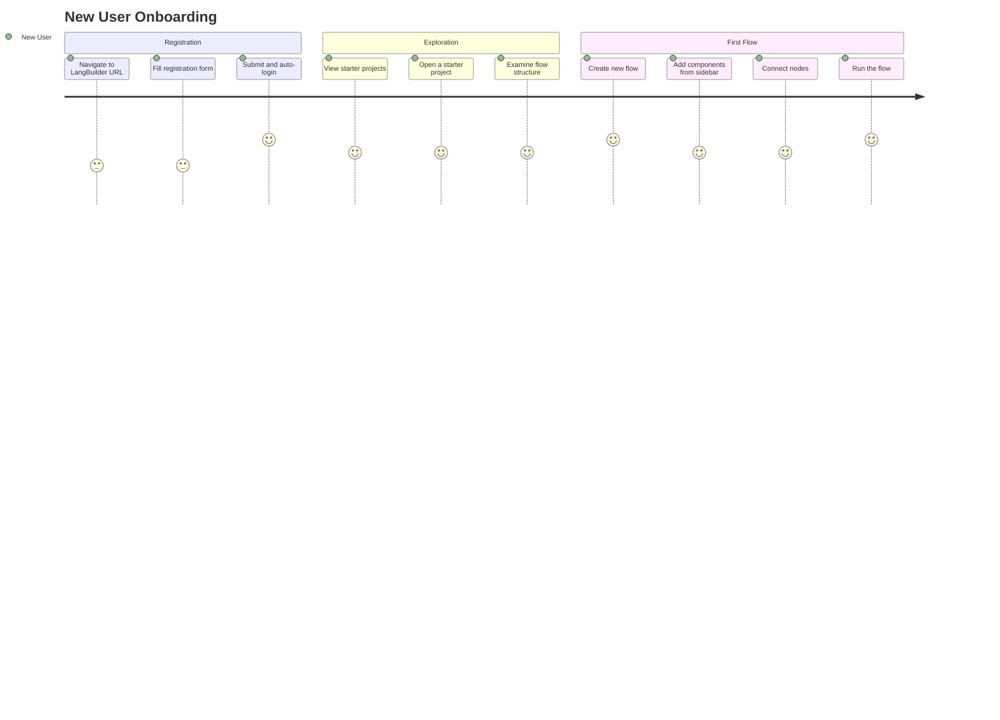
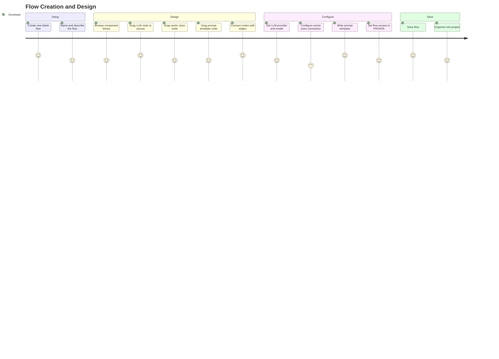
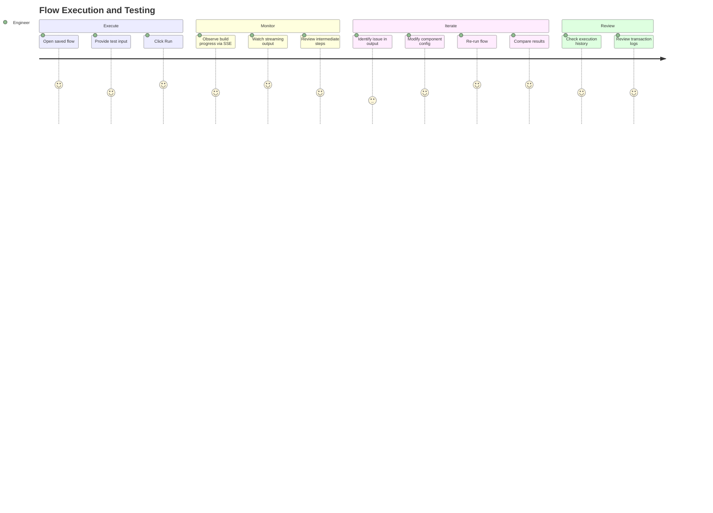
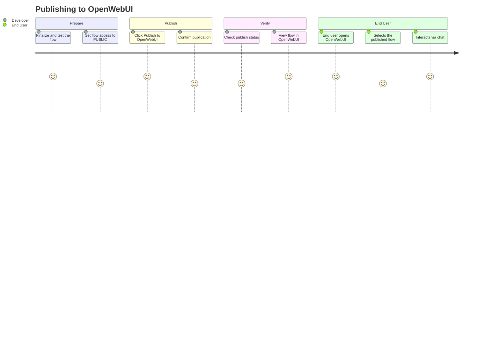
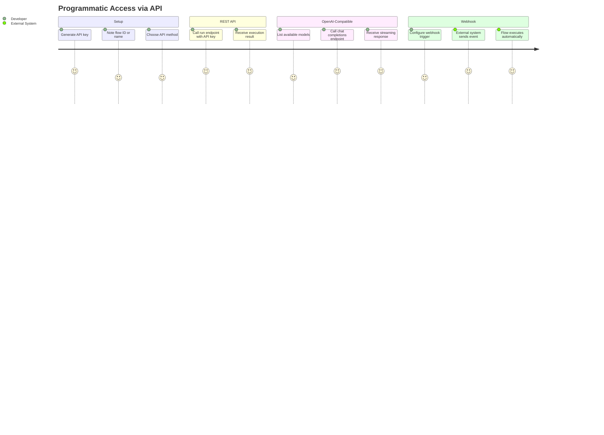
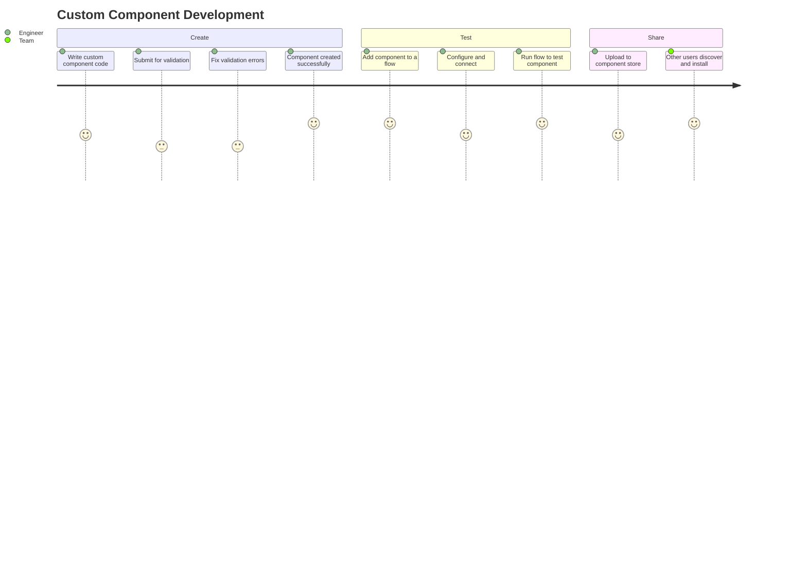
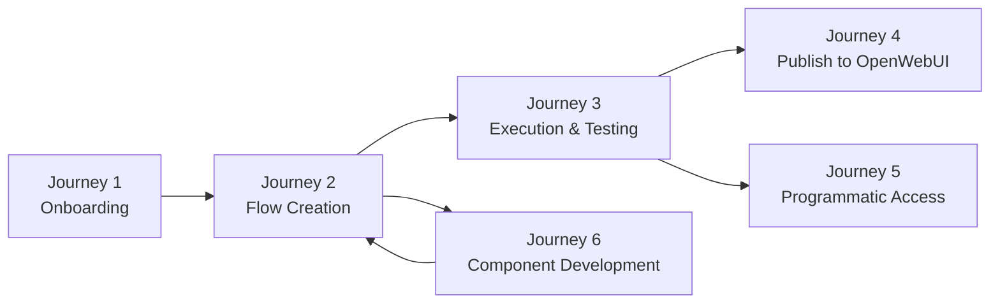

# User Journeys - LangBuilder v1.6.5

> Generated: 2026-02-09 | LangBuilder v1.6.5

## Overview

This document describes the primary user journeys through the LangBuilder platform, mapping each journey from the user's goal through the specific steps, system responses, and API endpoints involved. Each journey is derived from analysis of the API surface, authentication flows, and frontend interaction patterns.

**Evidence attribution:**
- `[CODE]` -- Verified from codebase (API endpoints, service layer, frontend routes)
- `[INFERRED]` -- Derived from code structure and API contracts
- `[ASSUMED]` -- Based on standard UX patterns for this application type

---

## Table of Contents

1. [New User Onboarding](#journey-1-new-user-onboarding)
2. [Flow Creation and Design](#journey-2-flow-creation-and-design)
3. [Flow Execution and Testing](#journey-3-flow-execution-and-testing)
4. [Publishing to OpenWebUI](#journey-4-publishing-to-openwebui)
5. [Programmatic Access via API](#journey-5-programmatic-access-via-api)
6. [Custom Component Development](#journey-6-custom-component-development)

---

## Journey 1: New User Onboarding

**Persona:** AI Engineer joining the team, first time using LangBuilder.
**Goal:** Register an account, explore the platform, and build a first working flow.

### Steps

| Step | User Action | System Response | Endpoint |
|------|-------------|-----------------|----------|
| 1 | Navigate to the LangBuilder URL in a browser | Display login/registration page `[ASSUMED]` | Frontend route |
| 2 | Fill in email, username, and password; click Register | Validate input, create user record with bcrypt-hashed password `[CODE]` | `POST /api/v1/users/` |
| 3 | (Automatic) | Issue JWT access token and refresh token; redirect to main canvas `[CODE]` | `POST /api/v1/login` |
| 4 | Click "Starter Projects" in the sidebar | Return list of pre-built example flows `[CODE]` | `GET /api/v1/starter-projects/` |
| 5 | Select a starter project (e.g., "Basic RAG") | Load the starter project flow definition with pre-configured nodes `[INFERRED]` | `POST /api/v1/flows/` (clone) |
| 6 | Review the flow on the canvas | Display nodes, edges, and component configurations in React Flow canvas `[CODE]` | `GET /api/v1/flows/{flow_id}` |
| 7 | Store API keys for integrated services | Encrypt and persist credential as a variable `[CODE]` | `POST /api/v1/variables/` |
| 8 | Click "Run" to test the starter flow | Build the flow graph, execute, and stream results back via SSE `[CODE]` | `POST /api/v1/build/{flow_id}/flow` |
| 9 | Review output in the output panel | Display streaming response with intermediate step visibility `[INFERRED]` | `GET /api/v1/build/{job_id}/events` |

**Key touchpoints:**
- Auto-login after registration eliminates friction `[CODE]`.
- Starter projects provide immediate, working examples `[CODE]`.
- Variable encryption ensures credentials are stored securely from the start `[CODE]`.

---

## Journey 2: Flow Creation and Design

**Persona:** Platform Developer building an AI-powered feature for a product.
**Goal:** Design, configure, and save a multi-component AI workflow from scratch.

### Steps

| Step | User Action | System Response | Endpoint |
|------|-------------|-----------------|----------|
| 1 | Click "New Flow" | Create a new empty flow record; open the canvas editor `[CODE]` | `POST /api/v1/flows/` |
| 2 | Set flow name and description | Update flow metadata `[INFERRED]` | `PATCH /api/v1/flows/{flow_id}` |
| 3 | Browse component sidebar | Return all available component types organized by category `[CODE]` | `GET /api/v1/all` |
| 4 | Drag an LLM component (e.g., OpenAI) onto canvas | Add node to the React Flow canvas at drop coordinates `[ASSUMED]` | Frontend state (Zustand) |
| 5 | Drag a vector store component (e.g., ChromaDB) | Add node to canvas `[ASSUMED]` | Frontend state |
| 6 | Drag a prompt template component | Add node to canvas `[ASSUMED]` | Frontend state |
| 7 | Connect node output handles to input handles | Create edges representing data flow between components `[ASSUMED]` | Frontend state |
| 8 | Configure OpenAI node: select model, set temperature, add API key variable | Node configuration updated in flow definition `[INFERRED]` | Frontend state |
| 9 | Configure vector store: set collection name, connection parameters | Node configuration updated `[INFERRED]` | Frontend state |
| 10 | Write prompt template with variable placeholders | Template text stored in node configuration `[INFERRED]` | Frontend state |
| 11 | Set flow access type to PRIVATE | Flow visibility restricted to owner and superusers `[CODE]` | `PATCH /api/v1/flows/{flow_id}` |
| 12 | Click "Save" (or auto-save triggers) | Persist complete flow definition (nodes, edges, configurations) to database `[CODE]` | `PATCH /api/v1/flows/{flow_id}` |
| 13 | Move flow into a project folder | Associate flow with a project for organization `[CODE]` | `PATCH /api/v1/flows/{flow_id}` or `PATCH /api/v1/projects/{project_id}` |

**Key touchpoints:**
- Component library (`GET /api/v1/all`) provides the full palette of 62+ integrations `[CODE]`.
- All canvas interactions happen in-browser via Zustand state management; only saves hit the API `[CODE]`.
- Flow access control (PRIVATE/PUBLIC) is set at creation or edit time `[CODE]`.

---

## Journey 3: Flow Execution and Testing

**Persona:** AI Engineer iterating on a flow to improve output quality.
**Goal:** Run a flow, observe execution in real time, review results, and iterate on the design.

### Steps

| Step | User Action | System Response | Endpoint |
|------|-------------|-----------------|----------|
| 1 | Select a flow from the flow list | Load flow definition and render on canvas `[CODE]` | `GET /api/v1/flows/{flow_id}` |
| 2 | Enter test input in the input panel | Input stored in client state for submission `[ASSUMED]` | Frontend state |
| 3 | Click "Run" button | Submit flow for execution; begin graph build process `[CODE]` | `POST /api/v1/build/{flow_id}/flow` |
| 4 | (Automatic) Observe build progress | Server sends build events via Server-Sent Events (SSE) `[CODE]` | `GET /api/v1/build/{job_id}/events` |
| 5 | Watch streaming LLM output | Tokens stream in real time as the LLM generates its response `[CODE]` | SSE event stream |
| 6 | (Optional) Cancel a long-running execution | Cancel the build job `[CODE]` | `POST /api/v1/build/{job_id}/cancel` |
| 7 | Review complete output | Final result displayed in the output panel `[INFERRED]` | SSE final event |
| 8 | Check execution history | View past builds, messages, and timing data `[CODE]` | `GET /api/v1/monitor/builds` |
| 9 | Review transaction logs | View detailed execution trace for debugging `[CODE]` | `GET /api/v1/monitor/transactions` |
| 10 | Identify an issue (e.g., wrong model, bad prompt) | User inspects node configurations `[ASSUMED]` | Frontend inspection |
| 11 | Modify component configuration | Update node settings (e.g., change temperature, edit prompt) `[INFERRED]` | Frontend state |
| 12 | Save and re-run | Persist changes and re-execute `[CODE]` | `PATCH /api/v1/flows/{flow_id}` then `POST /api/v1/build/{flow_id}/flow` |

**Key touchpoints:**
- SSE-based event streaming provides real-time visibility into multi-step flow execution `[CODE]`.
- Build cancellation allows users to abort runaway or incorrect executions `[CODE]`.
- Monitor endpoints provide historical data for debugging and optimization `[CODE]`.

---

## Journey 4: Publishing to OpenWebUI

**Persona:** Platform Developer who has built and tested a flow.
**Goal:** Make the flow available to end users through a conversational chat interface.

### Steps

| Step | User Action | System Response | Endpoint |
|------|-------------|-----------------|----------|
| 1 | Complete flow testing (see Journey 3) | Flow is in a stable, tested state `[INFERRED]` | -- |
| 2 | Set flow access to PUBLIC | Update flow access type so it is available for publishing `[CODE]` | `PATCH /api/v1/flows/{flow_id}` |
| 3 | Click "Publish to OpenWebUI" | Register the flow as an OpenWebUI function/pipe `[CODE]` | `POST /api/v1/publish/openwebui` |
| 4 | (Automatic) | System creates or updates the flow's representation in OpenWebUI `[INFERRED]` | Internal: OpenWebUI API |
| 5 | Check publication status | Return publication state (published, pending, error) `[CODE]` | `GET /api/v1/publish/status/{flow_id}` |
| 6 | View list of published flows | Return all flows currently published to OpenWebUI `[CODE]` | `GET /api/v1/publish/flows` |
| 7 | End user opens OpenWebUI | OpenWebUI displays available AI assistants/tools including published flows `[INFERRED]` | OpenWebUI frontend |
| 8 | End user selects the published flow | OpenWebUI routes the conversation to the LangBuilder flow execution engine `[INFERRED]` | OpenWebUI backend to LangBuilder API |
| 9 | End user chats with the flow | Messages are processed by the LangBuilder flow and responses stream back through OpenWebUI `[INFERRED]` | Internal flow execution |
| 10 | (Optional) Unpublish the flow | Remove the flow from OpenWebUI `[CODE]` | `DELETE /api/v1/publish/openwebui` |

**Key touchpoints:**
- Publishing transforms a technical flow into an end-user-facing chat application `[INFERRED]`.
- Publication status tracking ensures developers know whether deployment succeeded `[CODE]`.
- Unpublishing provides a quick rollback mechanism `[CODE]`.

---

## Journey 5: Programmatic Access via API

**Persona:** Backend Developer integrating LangBuilder flows into an existing application.
**Goal:** Execute a LangBuilder flow from external code using the REST API or OpenAI-compatible endpoint.

### Steps

| Step | User Action | System Response | Endpoint |
|------|-------------|-----------------|----------|
| 1 | Navigate to Settings > API Keys | Display existing API keys (names only, not values) `[CODE]` | `GET /api/v1/api_key/` |
| 2 | Click "Create API Key" | Generate a new `sk-{uuid}` key and display it once `[CODE]` | `POST /api/v1/api_key/` |
| 3 | Copy the API key and store it securely | Key is shown only at creation time `[INFERRED]` | -- |
| 4 | Note the target flow's ID or name | Flow ID from the URL or flow list `[INFERRED]` | `GET /api/v1/flows/` |

**Option A -- REST API (run endpoint):**

| Step | User Action | System Response | Endpoint |
|------|-------------|-----------------|----------|
| 5a | Send `POST /api/v1/run/{flow_id_or_name}` with `Authorization: Bearer sk-{uuid}` and input payload | Execute the flow and return the result `[CODE]` | `POST /api/v1/run/{flow_id_or_name}` |
| 6a | Parse the JSON response | Response contains the flow output `[CODE]` | -- |

**Option B -- OpenAI-Compatible API:**

| Step | User Action | System Response | Endpoint |
|------|-------------|-----------------|----------|
| 5b | Send `GET /v1/models` to list available flows as "models" | Return list of flows in OpenAI models format `[CODE]` | `GET /v1/models` |
| 6b | Send `POST /v1/chat/completions` with model (flow ID) and messages | Execute the flow and return result in OpenAI chat completion format `[CODE]` | `POST /v1/chat/completions` |
| 7b | (Optional) Set `stream: true` | Server sends response as SSE events matching OpenAI streaming format `[CODE]` | Same endpoint, SSE response |

**Option C -- Webhook:**

| Step | User Action | System Response | Endpoint |
|------|-------------|-----------------|----------|
| 5c | Configure an external system to POST to the webhook URL | -- | -- |
| 6c | External system sends POST with payload | Flow executes with the webhook payload as input `[CODE]` | `POST /api/v1/webhook/{flow_id_or_name}` |
| 7c | Parse the response | Webhook returns the flow execution result `[CODE]` | -- |

**Key touchpoints:**
- Three distinct integration methods cover different use cases: simple execution (run), drop-in replacement (OpenAI-compatible), and event-driven (webhook) `[CODE]`.
- OpenAI-compatible API means existing applications using the OpenAI SDK can point to LangBuilder with zero code changes `[INFERRED]`.
- API keys inherit the creating user's permissions, so access control is maintained for programmatic access `[CODE]`.

---

## Journey 6: Custom Component Development

**Persona:** AI Engineer extending LangBuilder with a custom integration or processing step.
**Goal:** Create a custom component, validate it, and share it through the component store.

### Steps

| Step | User Action | System Response | Endpoint |
|------|-------------|-----------------|----------|
| 1 | Write Python code for the custom component following the LangBuilder component API | -- | Local development |
| 2 | Submit the component code for validation | Validate syntax, imports, and conformance to the component interface `[CODE]` | `POST /api/v1/custom_component` |
| 3 | Review validation results | Return success or detailed error messages indicating what needs fixing `[CODE]` | Response from above |
| 4 | (If errors) Fix issues and resubmit | Re-validate until the component passes `[CODE]` | `POST /api/v1/custom_component/update` |
| 5 | Validate the component's prompt template (if applicable) | Check prompt syntax and variable references `[CODE]` | `POST /api/v1/validate/prompt` |
| 6 | Validate the component's code logic (if applicable) | Check code for common issues `[CODE]` | `POST /api/v1/validate/code` |
| 7 | Add the custom component to a test flow | Component appears in the component library under the custom category `[INFERRED]` | `GET /api/v1/all` (includes custom) |
| 8 | Configure, connect, and run the flow | Execute the flow including the custom component `[CODE]` | `POST /api/v1/build/{flow_id}/flow` |
| 9 | Verify output is correct | Review results in the output panel `[ASSUMED]` | `GET /api/v1/build/{job_id}/events` |
| 10 | Share the component to the store | Upload the component with metadata, tags, and description `[CODE]` | `POST /api/v1/store/components/` |
| 11 | Other users browse and discover the component | Component appears in the store with search and filtering `[CODE]` | `GET /api/v1/store/components/` |
| 12 | Other users install the component | Download and add to their available component library `[CODE]` | `GET /api/v1/store/components/{component_id}` |
| 13 | (Optional) Update the shared component | Push a new version to the store `[CODE]` | `PATCH /api/v1/store/components/{component_id}` |

**Key touchpoints:**
- Built-in validation endpoints catch errors before the component is used in a live flow `[CODE]`.
- The component store enables team-wide and community sharing without manual file distribution `[CODE]`.
- Custom components integrate seamlessly with all existing components on the canvas `[INFERRED]`.

---

## Journey Summary

| Journey | Primary Persona | Key Endpoints | Complexity |
|---------|----------------|---------------|------------|
| New User Onboarding | AI Engineer (new) | `/users/`, `/login`, `/starter-projects/`, `/build/` | Low |
| Flow Creation | Platform Developer | `/flows/`, `/all`, `/variables/` | Medium |
| Flow Execution | AI Engineer | `/build/{flow_id}/flow`, `/build/{job_id}/events`, `/monitor/` | Medium |
| Publishing to OpenWebUI | Platform Developer | `/publish/openwebui`, `/publish/status/`, `/publish/flows` | Low |
| Programmatic Access | Backend Developer | `/api_key/`, `/run/`, `/v1/chat/completions`, `/webhook/` | Medium |
| Component Development | AI Engineer | `/custom_component`, `/validate/`, `/store/components/` | High |

---

## Cross-Journey Dependencies

- **Journey 1 (Onboarding)** is a prerequisite for all other journeys -- users must have an account and be authenticated.
- **Journey 2 (Flow Creation)** is required before execution (Journey 3), publishing (Journey 4), or programmatic access (Journey 5).
- **Journey 6 (Component Development)** feeds back into Journey 2 by expanding the available component library.
- **Journeys 4 and 5** are independent paths for flow distribution -- publishing for end-user chat, API for programmatic integration.

---

*Generated by CloudGeometry AIx SDLC - Product Analysis*
